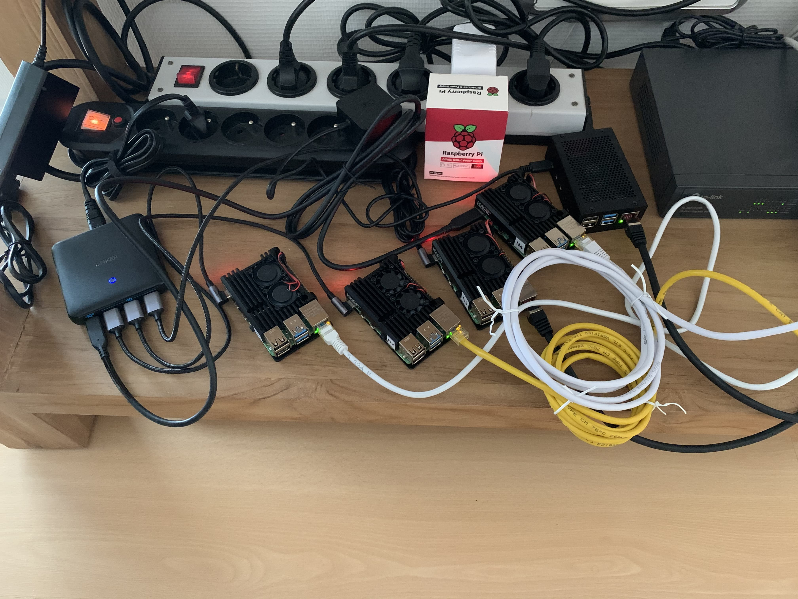

# PI4 Stories

## Raspberry Pi 4 cluster Series part 1

Before we can build a PI 4 cluster using kubernetes software of some kind (most likely k3s) we need to buy the required hardware to begin with. In our case we decided to go for 5 Raspberry Pi's type 4 with 4 GB RAM. We leave the exercise to you what size of SD card you want (more GB cost more money, but gives you some room for expansion later on). We also bought some small USB sticks (type SanDisk Ultra Fit USB 3.1 flash drive 128 GB) for building an object oriented file system (but that is for a later series).

Also, we bought some PI cases with fans built-in to keep the processor cool as we know kubernetes may heat up the processor [1]. We noticed that the temperature of a case with fans is around 40 degrees Celsius where with a metal case only (without fans) it is around 60 degrees Celsius. Decided to buy quickly an extra case with fans as it is worth its money.

We were charmed with Ubuntu 20 series software and downloaded the Pi4 64-bit version and used the `dd` command to burn it onto the SD cards [2].
Link it all together to start a Pi computer one at the time. The first time we hooked the micro-HDMI to a TV-screen so we could watch the first kick off and to see everything looked right. Also, we needed to reset the default password of the built-in account named 'ubuntu'.

By default the Pi computer is using DHCP for retrieving IP addresses, but we want to assign a static IPv4 address. Therefore, think ahaid and use something like this:

    cat >> /etc/hosts <<EOF
    
    # PI cluster
    192.168.0.201   n1
    192.168.0.202   n2
    192.168.0.203   n3
    192.168.0.204   n4
    192.168.0.205   n5
    EOF

Of course, change the IPv4 addresses to your local taste.

It is also a good idea to hard-code your local timezone, in our case we choose for Europe/Brussels, e.g.

    timedatectl set-timezone Europe/Brussels

The kubernetes cluster (not yet of course) prefers not having IPv6 active, therefore, disable it via:

    echo "net.ipv6.conf.all.disable_ipv6 = 1" >> /etc/sysctl.conf 
    sysctl -p

And, check the time settings:

    systemctl status systemd-timesyncd

To disable DHCP at next restart execute the following:

    cat > /etc/cloud/cloud.cfg.d/99-disable-network-config.cfg <<EOF
    # network: {config: disabled}
    network:
        ethernets:
            eth0:
                dhcp4: true
                optional: true
        version: 2
    EOF

And, lets hide the original netplan yaml file:

    mkdir /etc/netplan/.hide
    mv /etc/netplan/50-cloud-init.yaml /etc/netplan/.hide

The following steps differ node per node as we will define the hostname and fix the IPv4 address:

    hostnamectl set-hostname n1

Be careful, to use the correct hostname in above command. To define your permanent IPv4 address create your own netplan configuration as follow:

    cat > /etc/netplan/01-netcfg.yaml <<EOF
    # This file describes the network interfaces available on your system
    # For more information, see netplan(5).
    network:
      version: 2
      renderer: networkd
      ethernets:
        eth0:
          dhcp4: no
          # IP address/subnet mask
          addresses: [192.168.0.201/24]
          # default gateway
          gateway4: 192.168.0.1
          nameservers:
            # name server this host refers
            addresses: [192.168.0.1,8.8.8.8]
          dhcp6: no
    EOF

Then, edit the file `/etc/netplan/01-netcfg.yaml` to adjust the correct IPv4 address of the node and also modify the gateway IPv4 address to your needs.

On your laptop (or control server) we also add the IPv4 addresses of our Pi systems to the `/etc/hosts` file and to make your live easy copy your public OpenSSH keys to the ubuntu account like:

    ssh-copy-id ubuntu@n[1-5]

Reboot this Pi computer and try to login via your laptop using `ssh ubuntu@n1`

OK so far for the first part, but just want to share picture of our setup with 5 Raspberry Pi's 4 nodes n[1-5]:

### References:

[1] [Joy-it Armor case "Block Active" for Raspberry Pi 4](https://joy-it.net/en/products/RB-ALUcase+07FAN)

[2] [Download your Ubuntu Pi image](https://ubuntu.com/download/raspberry-pi)

### Edit history

- Initial post on 01 July 2020
