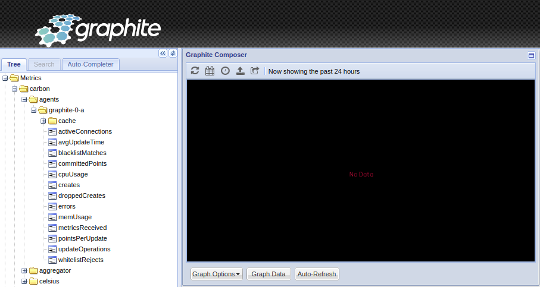
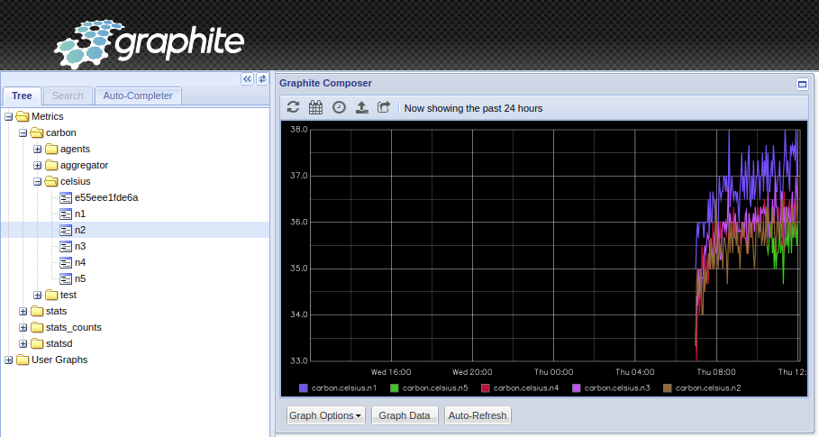

# PI4 Stories

## Raspberry Pi 4 cluster Series - Spin up graphite and temperature2celsius pods

Graphite is an enterprise-ready monitoring tool that runs equally well on cheap hardware or Cloud infrastructure. Teams use Graphite to track the performance of their websites, applications, business services, and networked servers. It marked the start of a new generation of monitoring tools, making it easier than ever to store, retrieve, share, and visualize time-series data. Info copied from web-site [graphiteapp.org](https://graphiteapp.org/).

### Spin up graphite pod

To start we need the sources to build of graphite pod, therefore, clone our github repository:

```bash
git clone  https://github.com/gdha/pi4-graphite.git
```

You will find in the `pi4-graphite` directory a Dockerfile which will be used to create a new container image:

```bash
To build the docker image on your Pi4 system execute the following command:

$ ./build.sh v1.2
Login Succeeded
Building graphite:v1.2
Sending build context to Docker daemon  137.2kB
Step 1/11 : FROM graphiteapp/graphite-statsd:1.1.10-4
1.1.10-4: Pulling from graphiteapp/graphite-statsd
9981e73032c8: Pull complete 
de219cb0be19: Pull complete 
a152a03e3913: Pull complete 
1e02b3e21032: Pull complete 
fb7d8007a803: Pull complete 
Digest: sha256:fb9eb6fdd8f6073dd4ff1acd2169b693d4633045017701713651befbc62fe9f5
Status: Downloaded newer image for graphiteapp/graphite-statsd:1.1.10-4
...
Successfully built afb29746df49
Successfully tagged ghcr.io/gdha/graphite:v1.2
Pushing graphite:v1.2 to GitHub Docker Container registry
```

To start the graphite pod on our kubernetes cluster do the following:

```bash
$ cd kubernetes
$ kubectl apply -f ./graphite-namespace.yaml 
namespace/graphite created
$ kubectl apply -f ./graphite-secret.yaml 
secret/graphite created
$ kubectl apply -f ./ghcr-secret.yaml secret/dockerconfigjson-github-com 
created
$ kubectl apply -f ./persistentvolumeclaim-graphite.yaml persistentvolumeclaim/graphite 
created
$ kubectl apply -f ./statefulset_graphite.yaml statefulset.apps/graphite 
created
$ kubectl apply -f ./service_graphite.yaml service/graphite-svc 
created
```

Open a browser with URL http://n1:30080 to see the result of the tests:



### Deploy temperature2celsius pods

The purpose of this pod is to demonstrate that we can send information to our graphite application. We choose to send the temperatire in Celsius once a minute.

Start with cloning our github repository:

```bash
git clone https://github.com/gdha/pi4-temperature2graphite.git
cd pi4-temperature2graphite
```
The `Dockerfile` content is:

```bash
 Dockerfile to create the container used to send the temperature of the RPI4
# to the graphite pod
#FROM gdha/rpi-alpine-rootfs/alpine:v1.37
FROM alpine:latest

LABEL org.opencontainers.image.sourcec=https://github.com/gdha/pi4-temperature2graphite
LABEL org.opencontainers.image.description "pi4-temperature2graphite build for the ARM64"
LABEL org.opencontainers.image.licenses "GPL-3.0-or-later"
LABEL maintainer "Gratien Dhaese <gratien.dhaese@gmail.com>"

COPY entrypoint.sh                                  /entrypoint.sh
COPY k3s                                            /usr/bin/kubectl
COPY api_query.sh                                   /api_query.sh

# Update and install dependencies
RUN  apk add --update nodejs npm curl
RUN  chmod a+x                                      /entrypoint.sh \
     && chmod a+x                                   /api_query.sh  \
     && echo "Europe/Brussels" >                    /etc/timezone  \
     && chmod 755 /root
```

And, the center of the image is the `entry.sh` script:

```bash
!/bin/sh

# As this script runs on Alpine (busybox) we cannot use bash syntax
#set -e
HOSTNAME=$(cat /etc/hostname)
#SERVER=$(/usr/local/bin/kubectl -n graphite describe pod graphite-0 | grep -i node: | cut  -d/ -f2)
while true
do
  # move the SERVER line inside the loop as at each restart the graphite pod gets a new IP address
  SERVER=$(/usr/bin/kubectl -n graphite get pods -o wide | tail -1 | awk '{print $6}')
  cpu_temp=$(cat /sys/class/thermal/thermal_zone0/temp)
  #cpu_temp=$(($cpu_temp/1000))
  cpu_temp=$(expr $cpu_temp / 1000)
  echo "carbon.celsius.$HOSTNAME $cpu_temp $(date +%s)" | timeout 2 nc $SERVER 2003 
  # echo $cpu_temp
  sleep 60
done
```

To build the image use the `build.sh` script and it pushes the image to ghcr.io/gdha/pi4-temperature2graphite:v1.7 (which is also the latest).

To bring the pods alive on our kubernetes cluster go to the `kubernetes` directory and execute:

```bash
$ kubectl apply -f celsius-namespace.yaml
namespace/celsius created

 kubectl apply -f celsius-secret.yaml
secret/celsius created

$ kubectl apply -f ghcr-secret.yaml 
secret/dockerconfigjson-github-com created

$ kubectl apply -f celsius-rbac.yaml 
erviceaccount/celsius-sa created
clusterrole.rbac.authorization.k8s.io/celsius-cluster-role created
rolebinding.rbac.authorization.k8s.io/celsius-cluster-role-binding-ns-celsius created
rolebinding.rbac.authorization.k8s.io/celsius-cluster-role-binding-ns-graphite created

$ kubectl apply -f celsius-deployment.yaml
deployment.apps/celsius created

$ kubectl get pods -n celsius -w
NAME                       READY   STATUS              RESTARTS   AGE
celsius-6ffb4f4bcc-jl579   0/1     ContainerCreating   0          16s
celsius-6ffb4f4bcc-kh4dh   0/1     ContainerCreating   0          16s
celsius-6ffb4f4bcc-qzt8w   0/1     ContainerCreating   0          16s
celsius-6ffb4f4bcc-nfgnx   0/1     ContainerCreating   0          16s
celsius-6ffb4f4bcc-nptk6   0/1     ContainerCreating   0          16s
celsius-6ffb4f4bcc-kh4dh   1/1     Running             0          81s
celsius-6ffb4f4bcc-nfgnx   1/1     Running             0          83s
celsius-6ffb4f4bcc-nptk6   1/1     Running             0          84s
celsius-6ffb4f4bcc-jl579   1/1     Running             0          86s
celsius-6ffb4f4bcc-qzt8w   1/1     Running             0          89s

$ kubectl logs -n celsius celsius-6ffb4f4bcc-qzt8w
INFO[0000] Acquiring lock file /var/lib/rancher/k3s/data/.lock 
INFO[0000] Preparing data dir /var/lib/rancher/k3s/data/8c4262cf7fdd652cccb03a99a99fdffc96d9ad41d7e57af9eb08c7ac2867c72a 
```

After a couple of minutes you can check the graphite site again:


