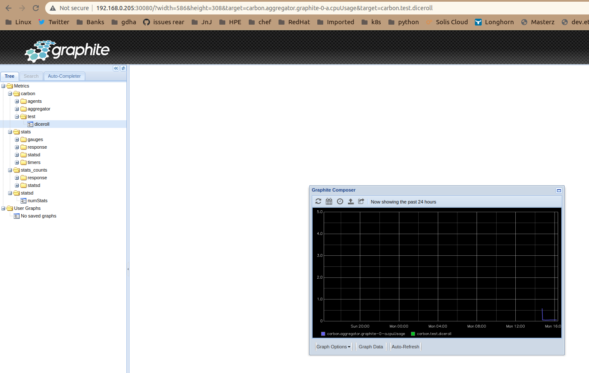

# PI4 Stories

## Raspberry Pi 4 cluster Series - Spin up graphite and temperature2celsius pods

Graphite is an enterprise-ready monitoring tool that runs equally well on cheap hardware or Cloud infrastructure. Teams use Graphite to track the performance of their websites, applications, business services, and networked servers. It marked the start of a new generation of monitoring tools, making it easier than ever to store, retrieve, share, and visualize time-series data. Info copied from web-site [graphiteapp.org](https://graphiteapp.org/).

### Spin up graphite pod

To start we need the sources to build of graphite pod, therefore, clone our github repository:

```bash
git clone  https://github.com/gdha/pi4-graphite.git
```

You will find in the `pi4-graphite` directory a Dockerfile which will be used to create a new container image:

```bash
To build the docker image on your Pi4 system execute the following command:

$ ./build.sh v1.2
Login Succeeded
Building graphite:v1.2
Sending build context to Docker daemon  137.2kB
Step 1/11 : FROM graphiteapp/graphite-statsd:1.1.10-4
1.1.10-4: Pulling from graphiteapp/graphite-statsd
9981e73032c8: Pull complete 
de219cb0be19: Pull complete 
a152a03e3913: Pull complete 
1e02b3e21032: Pull complete 
fb7d8007a803: Pull complete 
Digest: sha256:fb9eb6fdd8f6073dd4ff1acd2169b693d4633045017701713651befbc62fe9f5
Status: Downloaded newer image for graphiteapp/graphite-statsd:1.1.10-4
...
Successfully built afb29746df49
Successfully tagged ghcr.io/gdha/graphite:v1.2
Pushing graphite:v1.2 to GitHub Docker Container registry
```

To start the graphite pod on our kubernetes cluster do the following:

```bash
$ cd kubernetes
$ kubectl apply -f ./graphite-namespace.yaml 
namespace/graphite created
$ kubectl apply -f ./graphite-secret.yaml 
secret/graphite created
$ kubectl apply -f ./ghcr-secret.yaml secret/dockerconfigjson-github-com 
created
$ kubectl apply -f ./persistentvolumeclaim-graphite.yaml persistentvolumeclaim/graphite 
created
$ kubectl apply -f ./statefulset_graphite.yaml statefulset.apps/graphite 
created
$ kubectl apply -f ./service_graphite.yaml service/graphite-svc 
created
```

Open a browser with URL http://n1:30080 to see the result of the tests:



