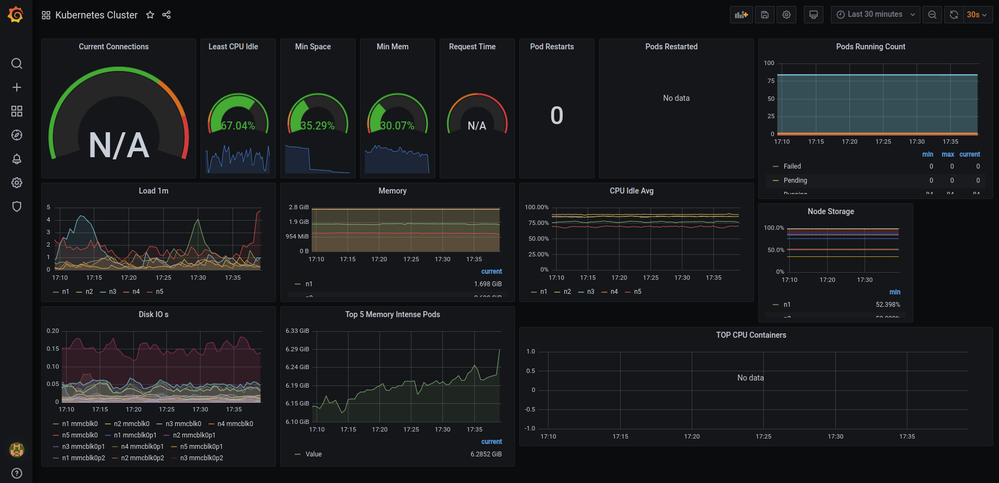
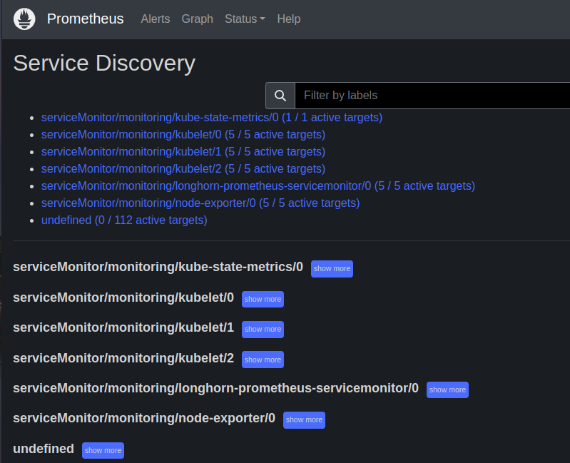
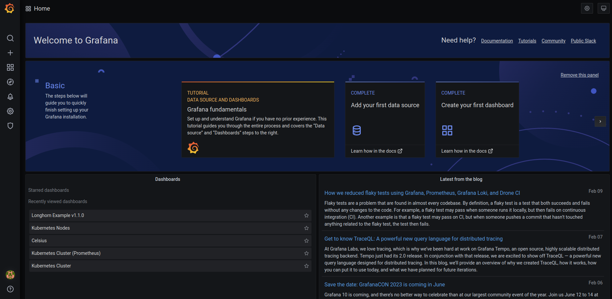
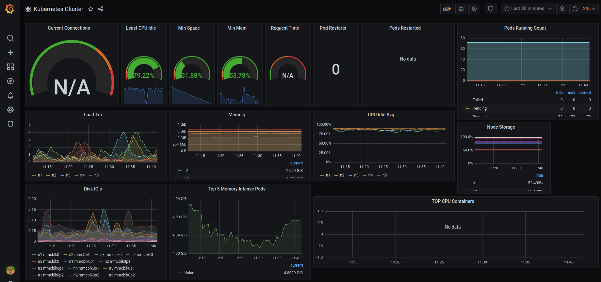
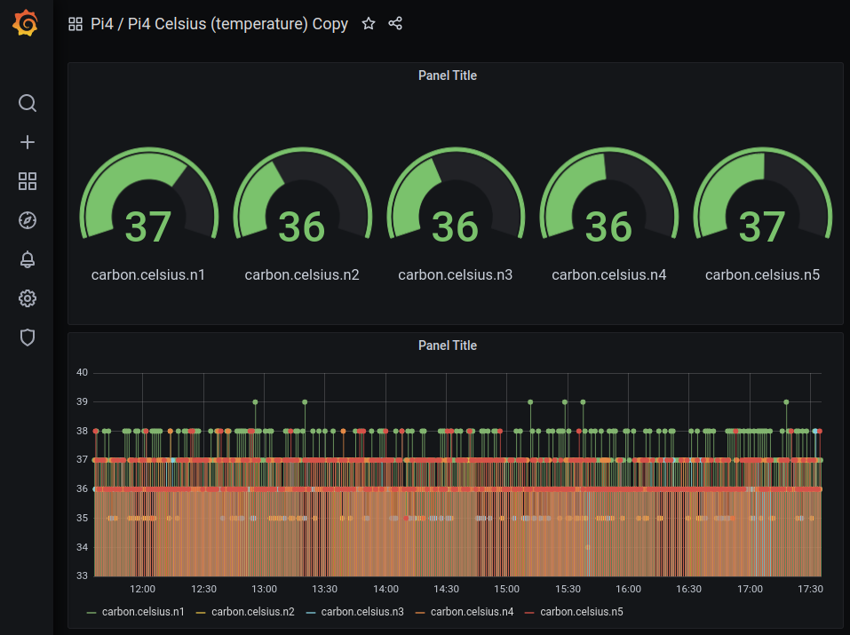

 PI4 Stories

## Raspberry Pi 4 cluster Series - Setup monitoring

This story is mostly based on [K3s Monitoring](https://rpi4cluster.com/monitoring/monitor-intro/). Basically, we need to install Prometheus and many other components to be able to feed Grafana. Our goal is to get something like:



### Prometheus Operator

One instance that will help us provision Prometheus, and some of its components. It extends the Kubernetes API, so that when we create some YAML deployments it will look as if we’re telling Kubernetes to deploy something, but it’s actually telling Prometheus Operator to do it for us. Official documentation: [Prometheus Operator](https://prometheus-operator.dev/docs/prologue/introduction/)

We executed the following steps to install the Prometheus Operator [1]:

```bash
wget https://raw.githubusercontent.com/prometheus-operator/prometheus-operator/master/bundle.yaml
```

Followed by editing with sed the `bundle.yaml` file to replace the default namespace by monitoring (which is the namespace in where we want to built our monitoring tools for kubernetes).

Then we first create the namespace and apply the bundle.yaml file as seen below:

```bash
$ grep 'namespace: default' bundle.yaml
  namespace: default
  namespace: default
  namespace: default
  namespace: default

$ sed -i 's/namespace: default/namespace: monitoring/g' bundle.yaml

$ grep 'namespace: ' bundle.yaml
                      a `namespace: <object namespace>` matcher.'
  namespace: monitoring
  namespace: monitoring
  namespace: monitoring
  namespace: monitoring

$ kubectl create -f ../monitoring-namespace.yaml 
namespace/monitoring created

$ kubectl apply --server-side -f bundle.yaml 
customresourcedefinition.apiextensions.k8s.io/alertmanagerconfigs.monitoring.coreos.com serverside-applied
customresourcedefinition.apiextensions.k8s.io/alertmanagers.monitoring.coreos.com serverside-applied
customresourcedefinition.apiextensions.k8s.io/podmonitors.monitoring.coreos.com serverside-applied
customresourcedefinition.apiextensions.k8s.io/probes.monitoring.coreos.com serverside-applied
customresourcedefinition.apiextensions.k8s.io/prometheuses.monitoring.coreos.com serverside-applied
customresourcedefinition.apiextensions.k8s.io/prometheusrules.monitoring.coreos.com serverside-applied
customresourcedefinition.apiextensions.k8s.io/servicemonitors.monitoring.coreos.com serverside-applied
customresourcedefinition.apiextensions.k8s.io/thanosrulers.monitoring.coreos.com serverside-applied
clusterrolebinding.rbac.authorization.k8s.io/prometheus-operator serverside-applied
clusterrole.rbac.authorization.k8s.io/prometheus-operator serverside-applied
deployment.apps/prometheus-operator serverside-applied
serviceaccount/prometheus-operator serverside-applied
service/prometheus-operator serverside-applied


$ kubectl get pods -n monitoring
NAME                                   READY   STATUS    RESTARTS   AGE
prometheus-operator-6d56dc87f4-tg5qh   1/1     Running   0          25s
```
Next step is to prepare the service monitors.

### Install Service Monitors












### References

[1] [Prometheus Operator GitHub sources](https://github.com/gdha/pi4-monitoring/tree/master/prometheus-operator)
