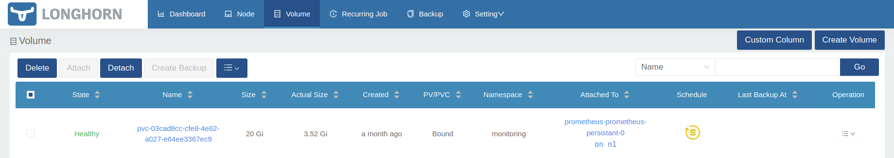
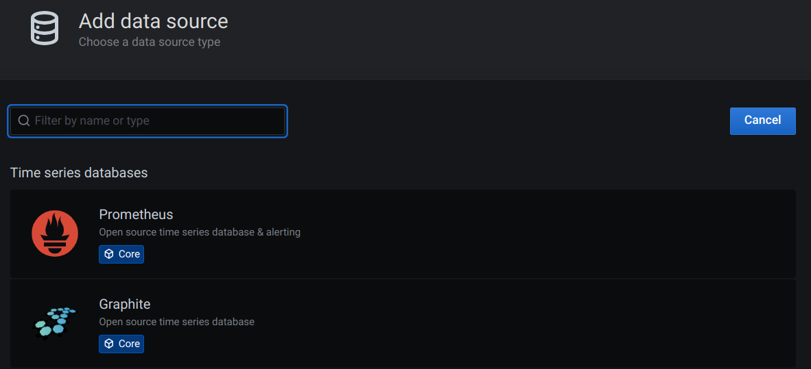
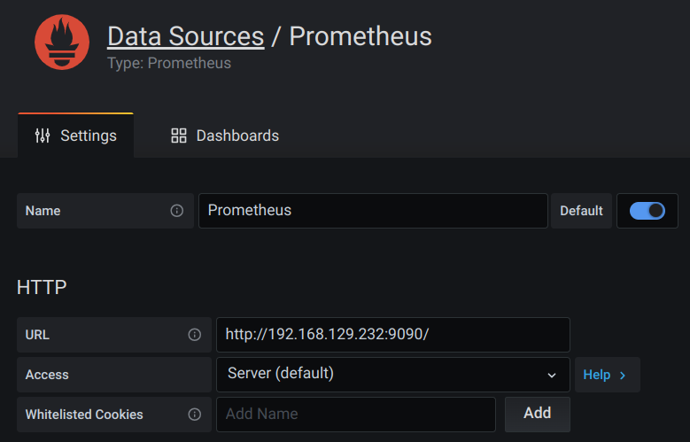
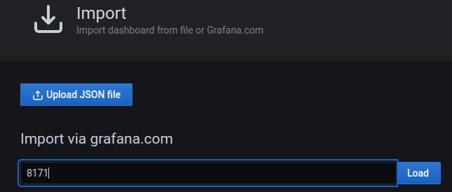
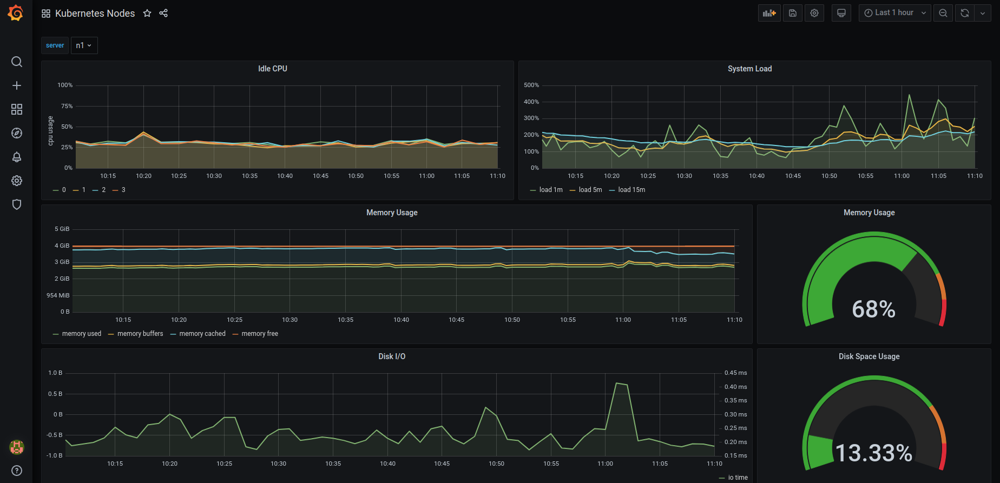

# PI4 Stories

## Raspberry Pi 4 cluster Series - Setup monitoring

This story is mostly based on [K3s Monitoring](https://rpi4cluster.com/monitoring/monitor-intro/). Basically, we need to install Prometheus and many other components to be able to feed Grafana. Our goal is to get something like:


To start we have to download the [pi4-monitoring GitHub project](https://github.com/gdha/pi4-monitoring):

```bash
$ git clone https://github.com/gdha/pi4-monitoring.git
$ cd pi4-monitoring
$ ls
grafana  images  kubelet  kube-state-metrics  LICENSE  longhorn-servicemonitor.yaml  monitoring-namespace.yaml  node-exporter  prometheus  prometheus-operator  readme.md  traefik
```

### Prometheus Operator

One instance that will help us provision Prometheus, and some of its components. It extends the Kubernetes API, so that when we create some YAML deployments it will look as if we’re telling Kubernetes to deploy something, but it’s actually telling Prometheus Operator to do it for us. Official documentation: [Prometheus Operator](https://prometheus-operator.dev/docs/prologue/introduction/)

We executed the following steps to install the Prometheus Operator [1] - is optional as it is already present and prepared under the prometheus-operator directory:

```bash
$ cd prometheus-operator
$ wget https://raw.githubusercontent.com/prometheus-operator/prometheus-operator/master/bundle.yaml
```

Followed by editing with sed the `bundle.yaml` file to replace the default namespace by monitoring (which is the namespace in where we want to built our monitoring tools for kubernetes).

Then we first create the namespace and apply the bundle.yaml file as seen below:

```bash
$ grep 'namespace: default' bundle.yaml
  namespace: default
  namespace: default
  namespace: default
  namespace: default

$ sed -i 's/namespace: default/namespace: monitoring/g' bundle.yaml

$ grep 'namespace: ' bundle.yaml
                      a `namespace: <object namespace>` matcher.'
  namespace: monitoring
  namespace: monitoring
  namespace: monitoring
  namespace: monitoring
```

To create the prometheus-operator we first need to create the namespace `monitoring`:

```bash
$ kubectl create -f ../monitoring-namespace.yaml 
namespace/monitoring created
```

Then, we can create the prometheus-operator as follow:

```bash
$ cd ~/projects/pi4-monitoring/prometheus-operator
$ kubectl apply --server-side -f bundle.yaml 
customresourcedefinition.apiextensions.k8s.io/alertmanagerconfigs.monitoring.coreos.com serverside-applied
customresourcedefinition.apiextensions.k8s.io/alertmanagers.monitoring.coreos.com serverside-applied
customresourcedefinition.apiextensions.k8s.io/podmonitors.monitoring.coreos.com serverside-applied
customresourcedefinition.apiextensions.k8s.io/probes.monitoring.coreos.com serverside-applied
customresourcedefinition.apiextensions.k8s.io/prometheuses.monitoring.coreos.com serverside-applied
customresourcedefinition.apiextensions.k8s.io/prometheusrules.monitoring.coreos.com serverside-applied
customresourcedefinition.apiextensions.k8s.io/servicemonitors.monitoring.coreos.com serverside-applied
customresourcedefinition.apiextensions.k8s.io/thanosrulers.monitoring.coreos.com serverside-applied
clusterrolebinding.rbac.authorization.k8s.io/prometheus-operator serverside-applied
clusterrole.rbac.authorization.k8s.io/prometheus-operator serverside-applied
deployment.apps/prometheus-operator serverside-applied
serviceaccount/prometheus-operator serverside-applied
service/prometheus-operator serverside-applied


$ kubectl get pods -n monitoring
NAME                                   READY   STATUS    RESTARTS   AGE
prometheus-operator-6d56dc87f4-tg5qh   1/1     Running   0          25s
```
Next step is to prepare the service monitors.

### Install Service Monitors

#### Prometheus Node Exporter

We will install the Prometheus Node Exporter [2] service which is a daemonset to collect metrics from individual cluster nodes, and many other details.
The [installation is quite simple](https://github.com/gdha/pi4-monitoring/tree/master/node-exporter).

```bash
$ cd ~/projects/pi4-monitoring
$ kubectl apply -f node-exporter/
clusterrolebinding.rbac.authorization.k8s.io/node-exporter created
clusterrole.rbac.authorization.k8s.io/node-exporter created
daemonset.apps/node-exporter created
serviceaccount/node-exporter created
servicemonitor.monitoring.coreos.com/node-exporter created
service/node-exporter created
```

This will create all permissions, and deploy the pod with the application Node Exporter, that will read metrics from Linux.

After doing so, you should see node-exporter-xxxx pods in the monitoring namespace; I have 5 nodes, so it’s there 5 times.

```bash
$ kubectl get pods -n monitoring -o wide
NAME                                   READY   STATUS    RESTARTS   AGE   IP              NODE   NOMINATED NODE   READINESS GATES
prometheus-operator-6d56dc87f4-tg5qh   1/1     Running   0          10m   10.42.2.197     n2     <none>           <none>
node-exporter-flgs7                    2/2     Running   0          61s   192.168.0.204   n4     <none>           <none>
node-exporter-r4wfz                    2/2     Running   0          61s   192.168.0.202   n2     <none>           <none>
node-exporter-jblkk                    2/2     Running   0          61s   192.168.0.201   n1     <none>           <none>
node-exporter-fhkw6                    2/2     Running   0          61s   192.168.0.203   n3     <none>           <none>
node-exporter-jwt8k                    2/2     Running   0          61s   192.168.0.205   n5     <none>           <none>
```

#### Kube State Metrics

This is a simple service that listens to the Kubernetes API, and generates metrics about the state of the objects.

Link to official GitHub: [kube-state-metrics](https://github.com/kubernetes/kube-state-metrics).

When we download the [GitHub project pi4-monitoring](https://github.com/gdha/pi4-monitoring) then `cd ~/projects/pi4monitoring` and execute:

```bash
$ kubectl apply -f kube-state-metrics/
$ kubectl get pods -n monitoring | grep kube-state
kube-state-metrics-6f8578cffd-cmks6    1/1     Running   19 (93m ago)   45d
```

#### Kubelet

Kubelet, in case you did not know, is an essential part of Kubernetes’ control plane, and is also something that exposes Prometheus metrics by default in the port 10255.
And as before:

```bash
$ cd ~/projects/pi4monitoring
$ kubectl apply -f kubelet-servicemonitor.yaml
servicemonitor.monitoring.coreos.com/kubelet created
```

#### Traefik

I do not use Traefik much in my setup, but it is there, and it also exposes Prometheus-ready data, so why not...

```bash
$ cd ~/projects/pi4monitoring
$ kubectl apply -f traefik-servicemonitor.yaml
servicemonitor.monitoring.coreos.com/traefik created
$ kubectl get servicemonitors.monitoring.coreos.com -n monitoring
NAME                                 AGE
node-exporter                        45d
kube-state-metrics                   45d
kubelet                              45d
traefik                              45d
```

### Install Prometheus

Now, we are going to deploy a single instance of Prometheus. Normally, you would/should deploy multiple instances spread throughout the cluster. For example, one instance dedicated to monitor just Kubernetes API, the next dedicated to monitor nodes, and so on... As with many things in the Kubernetes world, there is no specific way things should look 🙂, so to save resources, we will deploy just one.

To deploy a single instance of prometheus perform the following actions:

```bash
$ cd ~/projects/pi4-monitoring
$ kubectl apply -f prometheus/
clusterrole.rbac.authorization.k8s.io/prometheus created
clusterrolebinding.rbac.authorization.k8s.io/prometheus created
serviceaccount/prometheus created
service/prometheus-external created
service/prometheus created
prometheus.monitoring.coreos.com/prometheus-persistant created
```

When you inside the `prometheus.yaml` file you will the Service Monitors we created:

```bash
  serviceMonitorSelector:
    matchExpressions:
    - key: name
      operator: In
      values:
      - longhorn-prometheus-servicemonitor
      - kube-state-metrics
      - node-exporter
      - kubelet
      - traefik
```

Furthermore, as storage we will be using the longhorn volumes as you can see:

```bash
  storage:
    volumeClaimTemplate:
      spec:
        accessModes:
          - ReadWriteOnce
        storageClassName: longhorn
        resources:
          requests:
            storage: 20Gi
```

The longhorn volume created is:



The `prometheus-service-ext.yaml` file defines the loadbalancer piece. See:

```bash
$ kubectl get svc -n monitoring | grep external
prometheus-external   LoadBalancer   10.43.53.220    192.168.0.232   9090:31862/TCP      45d
```

When you browse to URL: http://192.168.0.232:9090/ you will get to see :


You can reverse the background colors with the icons on the right corner (I prefer black as background). When you select the "Service Discovery" under the status tab you will see the following screen proofing we receive information about our kubernetes cluster:


#### Longhorn service monitor

Our storage provisioner Longhorn, that we deployed somewhere near the start of this whole K3s Kubernetes cluster setup, also natively provides data for Prometheus.

Create in the folder `monitoring`, that we will put most of our configs in, the file `[longhorn-servicemonitor.yaml](https://github.com/gdha/pi4-monitoring/blob/master/longhorn-servicemonitor.yaml)`.

As you can see, we are not talking to Kubernetes API (we are... but...), but to `apiVersion: monitoring.coreos.com/v1`, so we are basically telling Prometheus Operator to create something for us. In this case it’s kind: `ServiceMonitor`.

This should be clear, `metadata: -> namespace: monitoring`, we are telling it to deploy into our monitoring namespace.

The rest under `spec:` is basically telling what app the Service Monitor should "bind to". It’s looking for `app: longhorn-manager` in namespace `longhorn-system` and `port: manager`. This port could be a port number, but it also can have a name, so in this case it’s named manager.

Okay, ket us add the longhorm monitor service:

```bash
$ kubectl get servicemonitors.monitoring.coreos.com -n monitoring
NAME                 AGE
kube-state-metrics   32m
kubelet              9m34s
node-exporter        39m
traefik              8m57s

$ kubectl apply -f longhorn-servicemonitor.yaml
servicemonitor.monitoring.coreos.com/longhorn-prometheus-servicemonitor created

$ kubectl get servicemonitors.monitoring.coreos.com -n monitoring
NAME                                 AGE
kube-state-metrics                   32m
kubelet                              9m50s
longhorn-prometheus-servicemonitor   3s
node-exporter                        40m
traefik                              9m13s
```

This is the longhorn-manager we are targeting.

```bash
$ kubectl get daemonset -n longhorn-system
NAME                       DESIRED   CURRENT   READY   UP-TO-DATE   AVAILABLE   NODE SELECTOR   AGE
engine-image-ei-fc06c6fb   5         5         5       5            5           <none>          48d
longhorn-manager           5         5         5       5            5           <none>          48d
longhorn-csi-plugin        5         5         5       5            5           <none>          48d
```

To describe the daemonset of longhorn-manager execute:

```bash
$ kubectl describe daemonset longhorn-manager -n longhorn-system | grep Port
    Port:       <none>
    Host Port:  <none>
    Port:       9500/TCP
    Host Port:  0/TCP
```

Alright, now we can move on the grafana.

### Install grafana

Our grafana pod will also use a longhorn device as defined under file:

```bash
$ cat grafana/grafana-pvc.yaml
apiVersion: v1
kind: PersistentVolumeClaim
metadata:
  name: longhorn-grafana-pvc
  namespace: monitoring
spec:
  accessModes:
    - ReadWriteOnce
  storageClassName: longhorn
  resources:
    requests:
      storage: 10Gi
```

To install the pod just run:

```bash
$ cd ~/projects/pi4-monitoring
$ kubectl apply -f grafana/
deployment.apps/grafana created
persistentvolumeclaim/longhorn-grafana-pvc created
service/grafana created
serviceaccount/grafana created

$ kubectl get endpoints -n monitoring
NAME                  ENDPOINTS                                                              AGE
prometheus-operator   10.42.2.225:8080                                                       5d16h
kube-state-metrics    10.42.2.220:8081,10.42.2.220:8080                                      5d16h
prometheus-operated   10.42.2.233:9090                                                       5d16h
prometheus            10.42.2.233:9090                                                       5d16h
prometheus-external   10.42.2.233:9090                                                       5d16h
node-exporter         192.168.0.201:9100,192.168.0.202:9100,192.168.0.203:9100 + 2 more...   5d16h
grafana               10.42.1.21:3000                                                        2m44s

$ kubectl get svc -n monitoring
NAME                  TYPE           CLUSTER-IP      EXTERNAL-IP     PORT(S)             AGE
prometheus-operator   ClusterIP      None            <none>          8080/TCP            63d
node-exporter         ClusterIP      None            <none>          9100/TCP            62d
kube-state-metrics    ClusterIP      None            <none>          8080/TCP,8081/TCP   62d
prometheus-external   LoadBalancer   10.43.53.220    192.168.0.232   9090:31862/TCP      62d
prometheus            ClusterIP      10.43.78.140    <none>          9090/TCP            62d
prometheus-operated   ClusterIP      None            <none>          9090/TCP            62d
grafana               LoadBalancer   10.43.108.229   192.168.0.233   3000:32251/TCP      62d
```

Open a browser and use url http://192.168.0.233:3000/ and login with the default admin account with first time password admin.


The first thing we need to do is to add data sources, e.g. prometheus:



and fill in the URL we found before:



To import grafana dashboards we need to follow this procedure:

On the left pane we can import grafana graphs with "+" -> create -> import

From [GrafanaLabs](https://grafana.com/grafana/dashboards/) we can import some examples:

* Kubernetes Nodes from GrafanaLabs - copy the ID into your clipboard:


And, paste the ID into:



and, perform the import in your grafana window.
You will see the results in an instance:



* Another good example is [Kubernetes Cluster from GrafanaLabs](https://grafana.com/grafana/dashboards/7249-kubernetes-cluster/) to import into your grafana dashboard.


* Even better is to create your own dashboard, in our case the already existing graphite celsius graphs:


Try it out as it is not that complicated as an exercise and you will be proud of your first designed dashboard:


### References

[1] [Prometheus Operator GitHub sources](https://github.com/gdha/pi4-monitoring/tree/master/prometheus-operator)

[2] [Prometheus Node Exporter](https://github.com/prometheus/node_exporter)
