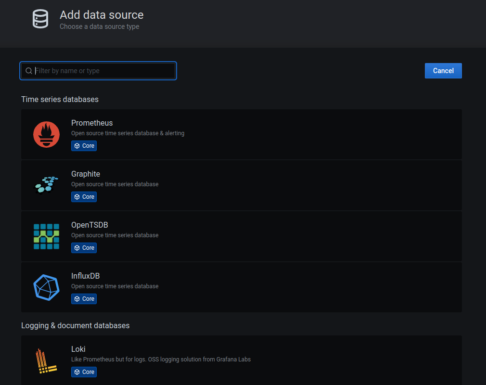
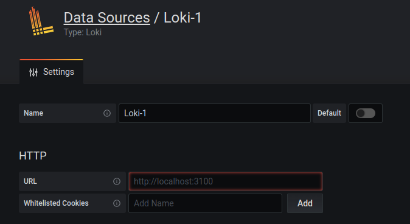

 PI4 Stories

## Raspberry Pi 4 cluster Series - Setup logging with Loki

This story is mostly based on [Logging Logs](https://rpi4cluster.com/monitoring/k3s-logging/) article.

We have our Prometheus and Grafana on k3s cluster if you followed my guides. But Prometheus is not able to get logs from k3s nodes, containers, Kubernetes API, and it's not made of that kind of monitoring. We need Loki + Promtail, you can find all info on their Grafana Loki and Promtail.

* Loki - or also known as Grafana Loki - log aggregation system, it does not index the contents of the logs, but rather a set of labels for each log stream. In simple terms, it's the app that accepts logs from everything and store it.

* Promtail - is a tool that reads the logs from various sources like OS, Containers, Kubernetes API server etc... and push them to Loki.

We will be using Arkade to install loki, therefore, we first need to install it.

### Install Arkade

This is basically Helm, just made even simpler.

More info about Arkade: [https://github.com/alexellis/arkade](https://github.com/alexellis/arkade)

```bash
$ curl -SLsf https://dl.get-arkade.dev/ | sudo sh
aarch64
Downloading package https://github.com/alexellis/arkade/releases/download/0.8.62/arkade-arm64 as /tmp/arkade-arm64
Download complete.

Running with sufficient permissions to attempt to move arkade to /usr/local/bin
New version of arkade installed to /usr/local/bin
Creating alias 'ark' for 'arkade'.
            _             _
  __ _ _ __| | ____ _  __| | ___
 / _` | '__| |/ / _` |/ _` |/ _ \
| (_| | |  |   < (_| | (_| |  __/
 \__,_|_|  |_|\_\__,_|\__,_|\___|

Open Source Marketplace For Developer Tools

Version: 0.8.62
Git Commit: 003e8716bbc987c412643af3a90cf87ef778bd2e

 🐳 arkade needs your support: https://github.com/sponsors/alexellis
gdha@n1:~/projects/pi4-logging$ ls /usr/local/bin
ark  arkade  crictl  golangci-lint  helm  k3s  k3s-killall.sh  k3s-uninstall.sh  kubectl  kube-linter
```

To upgrade arkade just re-run above command.

### Installation of loki and promtail

Before we start we have to make sure that the namespace has been created:

```bash
gdha@n1:~/projects/pi4-logging$ kubectl apply -f logging-namespace.yaml 
namespace/logging created
```

Then, we can use the installed `arkade` executable to install loki

```bash
gdha@n1:~/projects/pi4-logging$ arkade install loki -n logging  --persistence
2023/02/03 15:24:10 
Using Kubeconfig: /home/gdha/.kube/config
[Warning] unable to create namespace logging, may already exist: Error from server (AlreadyExists): namespaces "logging" already exists
Client: aarch64, Linux
2023/02/03 15:24:10 User dir established as: /home/gdha/.arkade/
2023/02/03 15:24:10 Looking up version for helm
2023/02/03 15:24:10 Found: v3.11.0
Downloading: https://get.helm.sh/helm-v3.11.0-linux-arm64.tar.gz
/tmp/helm-v3.11.0-linux-arm64.tar.gz written.
2023/02/03 15:24:14 Looking up version for helm
2023/02/03 15:24:14 Found: v3.11.0
2023/02/03 15:24:15 Extracted: /tmp/helm
2023/02/03 15:24:15 Copying /tmp/helm to /home/gdha/.arkade/bin/helm
Downloaded to:  /home/gdha/.arkade/bin/helm helm
"grafana" has been added to your repositories

Hang tight while we grab the latest from your chart repositories...
...Successfully got an update from the "metallb" chart repository
...Successfully got an update from the "longhorn" chart repository
...Successfully got an update from the "traefik" chart repository
...Successfully got an update from the "kiwigrid" chart repository
...Successfully got an update from the "grafana" chart repository
Update Complete. ⎈Happy Helming!⎈

VALUES values.yaml
Command: /home/gdha/.arkade/bin/helm [upgrade --install loki-stack grafana/loki-stack --namespace logging --values /tmp/charts/loki-stack/values.yaml --set loki.persistence.enabled=true]
Release "loki-stack" does not exist. Installing it now.
NAME: loki-stack
LAST DEPLOYED: Fri Feb  3 15:24:22 2023
NAMESPACE: logging
STATUS: deployed
REVISION: 1
NOTES:
The Loki stack has been deployed to your cluster. Loki can now be added as a datasource in Grafana.

See http://docs.grafana.org/features/datasources/loki/ for more detail.
=======================================================================
= loki has been installed.                                   =
=======================================================================

# Get started with loki here:
# https://grafana.com/docs/loki/latest

# See how to integrate loki with Grafana here
# https://grafana.com/docs/loki/latest/getting-started/grafana

# Check loki's logs with:

kubectl logs svc/loki-stack

kubectl logs svc/loki-stack-headless


# If you installed with Grafana you can access the dashboard with the username "admin" and password shown below
 # To get password
 kubectl get secret loki-stack-grafana -o jsonpath="{.data.admin-password}" | base64 --decode ; echo

 # Forward traffic to your localhost
 kubectl port-forward service/loki-stack-grafana 3000:80


whale arkade needs your support: https://github.com/sponsors/alexellis
```

Now, verify if the pods have been created:

```bash
gdha@n1:~/projects/pi4-logging$ kubectl get pods -n logging
NAME                        READY   STATUS    RESTARTS   AGE
loki-stack-0                0/1     Running   0          114s
loki-stack-promtail-d45tz   1/1     Running   0          114s
loki-stack-promtail-qv75h   1/1     Running   0          114s
loki-stack-promtail-rhcr9   1/1     Running   0          114s
loki-stack-promtail-dwz7s   1/1     Running   0          114s
loki-stack-promtail-4qwlg   1/1     Running   0          114s
```

As last we still need to apply the patch:

```bash
gdha@n1:~/projects/pi4-logging$ cat patch.yaml 
spec:
  template:
    spec:
      tolerations:
        - operator: Exists

gdha@n1:~/projects/pi4-logging$ kubectl patch daemonset loki-stack-promtail -n logging --patch "$(cat patch.yaml)"
daemonset.apps/loki-stack-promtail patched
```

Check if the services are available for usage:

```bash
gdha@n1:~/projects/pi4-logging$ kubectl get svc -n logging
NAME                    TYPE        CLUSTER-IP     EXTERNAL-IP   PORT(S)    AGE
loki-stack-headless     ClusterIP   None           <none>        3100/TCP   6m39s
loki-stack-memberlist   ClusterIP   None           <none>        7946/TCP   6m39s
loki-stack              ClusterIP   10.43.220.29   <none>        3100/TCP   6m39s
```

To view the logs we need to login onto our Grafana site and via configure - data sources - add data sources and search for Loki



and select "loki". On the next screen fill in the URL section the IP address found with 'loki-stack' service.



In our case it is `http://10.43.220.29:3100`

