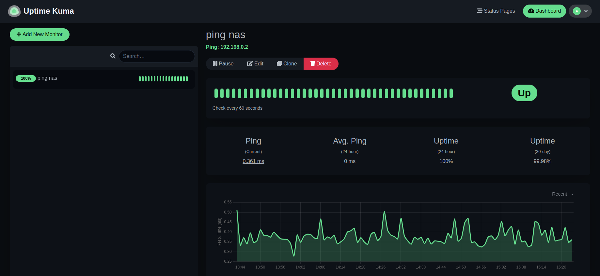

# PI4 Stories

## Raspberry Pi 4 cluster Series - Deploying uptime kuma with helm

### Download the GitHub sources of Uptime Kuma

We forked the original GitHub Sources of [https://github.com/k3rnelpan1c-dev/uptime-kuma-helm](https://github.com/k3rnelpan1c-dev/uptime-kuma-helm) to make our adjustments [1].

If you wonder what you can do with Uptime Kuma, then the best description found is "[Uptime Kuma is an easy-to-use self-hosted monitoring tool.](https://github.com/louislam/uptime-kuma)" - a simple example is to watch a NAS system with a simple `ping`:



### The container image content

The [directory](https://github.com/gdha/pi4-uptime-kuma-helm/tree/main/container) contains the Dockerfile to build the container image.

Within Uptime Kuma we can use [apprise](https://github.com/caronc/apprise) which is an interesting tool to send out notifications that we will be using outside this project as well.

### Build the Uptime Kuma for ARM64 architecture

We have set-up GitHub Actions to build a container image for [Uptime Kuma for x86_64/arm64 based images](https://github.com/gdha/pi4-uptime-kuma-helm/pkgs/container/uptime-kuma).

Before we used the GitHub Actions successfully, we wanted to have an image for ARM64 to build ourselves. We made a script `container/build.sh` to build the ARM64 based image:

```bash
REL=${1:-v1.0}
cat ~/.ghcr-token | docker login ghcr.io -u gdha --password-stdin
echo "Building pi4-uptime-kuma:$REL"
docker build --tag ghcr.io/gdha/pi4-uptime-kuma:$REL .
docker tag ghcr.io/gdha/pi4-uptime-kuma:$REL ghcr.io/gdha/pi4-uptime-kuma:latest
echo "Pushing pi4-uptime-kuma:$REL to GitHub Docker Container registry"
docker push ghcr.io/gdha/pi4-uptime-kuma:$REL
```

You can find the latest [Pi4 images for ARM64](https://github.com/users/gdha/packages/container/package/pi4-uptime-kuma). However, as GitHub Actions is now capable of building both x86_64 and arm64 we prefer to use [uptime-kuma images](https://github.com/gdha/pi4-uptime-kuma-helm/pkgs/container/uptime-kuma)


### Introducing the Helm chart of the Uptime Kuma application

Well this will be the first introduction with Helm charts [2]. [Helm](https://helm.sh/) is a package manager for Kubernetes [3] and we were interesting to have some more knowledge about it.

It might be better to clone our [uptime-kuma repository](https://github.com/gdha/pi4-uptime-kuma-helm) and go into directory `uptime-kuma` to find the helm chart, which we will use file based and not from a helm repository. We can do that later with a local helm repository, but we wanted to play around with helm first.

The helm chart of uptime kuma `Chart.yaml` [4]:

```bash
apiVersion: v2
name: uptime-kuma
description: A Helm chart for Uptime Kuma. A fancy self-hosted monitoring tool.

# A chart can be either an 'application' or a 'library' chart.
#
# Application charts are a collection of templates that can be packaged into versioned archives
# to be deployed.
#
# Library charts provide useful utilities or functions for the chart developer. They're included as
# a dependency of application charts to inject those utilities and functions into the rendering
# pipeline. Library charts do not define any templates and therefore cannot be deployed.
type: application

# This is the chart version. This version number should be incremented each time you make changes
# to the chart and its templates, including the app version.
# Versions are expected to follow Semantic Versioning (https://semver.org/)
version: 1.0.6

# This is the version number of the (container) application being deployed. This version number should be
# incremented each time you make changes to the application. Versions are not expected to
# follow Semantic Versioning. They should reflect the version the application is using.
# It is recommended to use it with quotes.
# Use: docker image ls  (to find the latest one)
appVersion: "1.23.2"

icon: https://github.com/louislam/uptime-kuma/blob/master/public/apple-touch-icon-precomposed.png

sources:
- https://github.com/k3rnelpan1c-dev/uptime-kuma-helm
- https://github.com/louislam/uptime-kuma
- https://helm.sh/docs/topics/charts/
```

And, the `values.yaml` file looks like:

```bash
# Default values for uptime-kuma.
# This is a YAML-formatted file.
# Declare variables to be passed into your templates.

## Specify override namespace, specifically this is useful for using as sub-chart
## and its release namespace is not the `uptime-kuma`
namespaceOverride: "uptime-kuma"

image:
  registry: "ghcr.io"
  repository: "gdha/uptime-kuma"
  pullPolicy: IfNotPresent
  # Overrides the image tag whose default is the Chart's appVersion.
  tag: ""

imagePullSecrets: [{name: dockerconfigjson-github-com}]
nameOverride: ""
fullnameOverride: ""

statefulSet:
  labels: {}
  annotations: {}

serviceAccount:
  # Specifies whether a service account should be created
  create: true
  # Annotations to add to the service account
  annotations: {}
  # The name of the service account to use.
  # If not set and create is true, a name is generated using the fullname template
  name: ""

podAnnotations: {}

podSecurityContext: {}
  # fsGroup: 2000

securityContext: {}
  # capabilities:
  #   drop:
  #   - ALL
  # readOnlyRootFilesystem: true
  # runAsNonRoot: true
  # runAsUser: 1000

livenessProbe:
  exec:
    command:
      - extra/healthcheck

readinessProbe:
  httpGet:
    path: /
    port: http
    scheme: HTTP

service:
  type: LoadBalancer
  port: 80

route:
  enabled: false
  annotations: {}
  host: ""
  labels: {}

ingress:
  enabled: false
  className: ""
  annotations: {}
    # kubernetes.io/ingress.class: nginx
    # kubernetes.io/tls-acme: "true"
  hosts:
    - host: chart-example.local
      paths:
        - path: /
          pathType: ImplementationSpecific
  tls: []
  #  - secretName: chart-example-tls
  #    hosts:
  #      - chart-example.local

resources: {}
  # We usually recommend not to specify default resources and to leave this as a conscious
  # choice for the user. This also increases chances charts run on environments with little
  # resources, such as Minikube. If you do want to specify resources, uncomment the following
  # lines, adjust them as necessary, and remove the curly braces after 'resources:'.
  # limits:
  #   cpu: 200m
  #   memory: 256Mi
  # requests:
  #   cpu: 100m
  #   memory: 128Mi

persistence:
  enabled: true
  claimNameOverwrite: ""
  sizeLimit: 4Gi
  storageClass: "longhorn"
  annotations: {}
  labels: {}

nodeSelector: {}

tolerations: []

affinity: {}

testPod:
  image: docker.io/busybox@sha256:3fbc632167424a6d997e74f52b878d7cc478225cffac6bc977eedfe51c7f4e79
  annotations: {}
```

Go into the `templates` directory:

```bash
gdha@n1:~/projects/pi4-uptime-kuma-helm/uptime-kuma/templates$ ll
total 52
drwxrwxr-x 4 gdha gdha 4096 Sep 28 15:44 ./
drwxrwxr-x 3 gdha gdha 4096 Aug 11 16:28 ../
lrwxrwxrwx 1 gdha gdha   24 Aug  7 16:33 ghcr-secret.yaml -> .hidden/ghcr-secret.yaml
-rw-rw-r-- 1 gdha gdha 2578 Feb 22  2023 _helpers.tpl
drwxrwxr-x 2 gdha gdha 4096 Sep 28 15:44 .hidden/
-rw-rw-r-- 1 gdha gdha 1705 Feb 22  2023 ingress.yaml
-rw-rw-r-- 1 gdha gdha 2140 Feb 22  2023 NOTES.txt
-rw-rw-r-- 1 gdha gdha  732 Feb 22  2023 pvc.yaml
-rw-rw-r-- 1 gdha gdha  817 Feb 22  2023 route.yaml
-rw-rw-r-- 1 gdha gdha  215 Feb 22  2023 secrets.yaml
-rw-rw-r-- 1 gdha gdha  381 Feb 22  2023 serviceaccount.yaml
-rw-rw-r-- 1 gdha gdha  457 Feb 22  2023 service.yaml
-rw-rw-r-- 1 gdha gdha 2557 Feb 22  2023 statefulSet.yaml
drwxrwxr-x 2 gdha gdha 4096 Feb 22  2023 tests/
```

where you will find the needed yaml files to start-up the uptime-kuma pod in your k3s kubernetes cluster.

Be aware that the `ghcr-secret.yaml` is hidden and you need to create this yourself under the `.hidden` directory as follow:

```bash
kubectl create secret docker-registry dockerconfigjson-github-com --docker-server=ghcr.io  --docker-username=$USER --docker-password=$(cat ~/.ghcr-token) --dry-run=client -oyaml >.hidden/ghcr-secret.yaml
```

Of course, you must have saved your secret GitHub token in the file `~/.ghcr-token`.

To to be to use the helm chart we need to first to create the namespace and do a dry-run of our chart:

```bash
$ pwd
/home/gdha/projects/pi4-uptime-kuma-helm
$ kubectl create namespace uptime-kuma
$ helm install --dry-run --namespace uptime-kuma uptime-kuma  ./uptime-kuma
walk.go:74: found symbolic link in path: /home/gdha/projects/pi4-uptime-kuma-helm/uptime-kuma/templates/ghcr-secret.yaml resolves to /home/gdha/projects/pi4-uptime-kuma-helm/uptime-kuma/templates/.hidden/ghcr-secret.yaml. Contents of linked file included and used
NAME: uptime-kuma
LAST DEPLOYED: Thu Oct  5 16:40:04 2023
NAMESPACE: uptime-kuma
STATUS: pending-install
REVISION: 1
HOOKS:
---
# Source: uptime-kuma/templates/tests/test-connection.yaml
apiVersion: v1
kind: Pod
metadata:
  name: "uptime-kuma-test-connection"
  namespace: uptime-kuma
  labels:
    helm.sh/chart: uptime-kuma-1.0.6
    app.kubernetes.io/name: uptime-kuma
    app.kubernetes.io/instance: uptime-kuma
    app.kubernetes.io/version: "1.22.1"
    app.kubernetes.io/managed-by: Helm
  annotations:
    "helm.sh/hook": test
spec:
  containers:
    - name: wget
      image: docker.io/busybox@sha256:3fbc632167424a6d997e74f52b878d7cc478225cffac6bc977eedfe51c7f4e79
      command: ["/bin/sh"]
      args: ['uptime-kuma:80']
      args: ["-c", "cd tmp/ ; wget 'uptime-kuma:80'"]
  restartPolicy: Never
MANIFEST:
---
# Source: uptime-kuma/templates/serviceaccount.yaml
apiVersion: v1
kind: ServiceAccount
metadata:
  name: uptime-kuma
  namespace: uptime-kuma
  labels:
    helm.sh/chart: uptime-kuma-1.0.6
    app.kubernetes.io/name: uptime-kuma
    app.kubernetes.io/instance: uptime-kuma
    app.kubernetes.io/version: "1.22.1"
    app.kubernetes.io/managed-by: Helm
---
# Source: uptime-kuma/templates/ghcr-secret.yaml
# kubectl create secret docker-registry dockerconfigjson-github-com --docker-server=ghcr.io  --docker-username=gdha --docker-password=$(cat ~/.ghcr-token) --dry-run=client -oyaml >.hidden/ghcr-secret.yaml
apiVersion: v1
data:
  .dockerconfigjson: xxxxxxxxxxxxxxxxxxxxxxxxxxxxxxx
kind: Secret
metadata:
  creationTimestamp: null
  name: dockerconfigjson-github-com
  namespace: uptime-kuma
  labels:
    helm.sh/chart: uptime-kuma-1.0.6
    app.kubernetes.io/name: uptime-kuma
    app.kubernetes.io/instance: uptime-kuma
    app.kubernetes.io/version: "1.22.1"
    app.kubernetes.io/managed-by: Helm
type: kubernetes.io/dockerconfigjson
---
# Source: uptime-kuma/templates/secrets.yaml
apiVersion: v1
kind: Secret
metadata:
  name: uptime-kuma
  namespace: uptime-kuma
  labels:
    helm.sh/chart: uptime-kuma-1.0.6
    app.kubernetes.io/name: uptime-kuma
    app.kubernetes.io/instance: uptime-kuma
    app.kubernetes.io/version: "1.22.1"
    app.kubernetes.io/managed-by: Helm
type: Opaque
---
# Source: uptime-kuma/templates/pvc.yaml
apiVersion: v1
kind: PersistentVolumeClaim
metadata:
  name: uptime-kuma
  namespace: uptime-kuma
  annotations:
  labels:
    helm.sh/chart: uptime-kuma-1.0.6
    app.kubernetes.io/name: uptime-kuma
    app.kubernetes.io/instance: uptime-kuma
    app.kubernetes.io/version: "1.22.1"
    app.kubernetes.io/managed-by: Helm
spec:
  accessModes:
    - ReadWriteOnce
  resources:
    requests:
      storage: "4Gi"
  storageClassName: "longhorn"
---
# Source: uptime-kuma/templates/service.yaml
apiVersion: v1
kind: Service
metadata:
  name: uptime-kuma
  namespace: uptime-kuma
  labels:
    helm.sh/chart: uptime-kuma-1.0.6
    app.kubernetes.io/name: uptime-kuma
    app.kubernetes.io/instance: uptime-kuma
    app.kubernetes.io/version: "1.22.1"
    app.kubernetes.io/managed-by: Helm
spec:
  type: LoadBalancer
  externalTrafficPolicy: Local
  ports:
    - port: 80
      targetPort: http
      protocol: TCP
      name: http
  selector:
    app.kubernetes.io/name: uptime-kuma
    app.kubernetes.io/instance: uptime-kuma
---
# Source: uptime-kuma/templates/statefulSet.yaml
apiVersion: apps/v1
kind: StatefulSet
metadata:
  name: uptime-kuma
  namespace: uptime-kuma
  labels:
    helm.sh/chart: uptime-kuma-1.0.6
    app.kubernetes.io/name: uptime-kuma
    app.kubernetes.io/instance: uptime-kuma
    app.kubernetes.io/version: "1.22.1"
    app.kubernetes.io/managed-by: Helm
  annotations:
spec:
  replicas: 1
  serviceName: uptime-kuma
  selector:
    matchLabels:
      app.kubernetes.io/name: uptime-kuma
      app.kubernetes.io/instance: uptime-kuma
  template:
    metadata:
      labels:
        app.kubernetes.io/name: uptime-kuma
        app.kubernetes.io/instance: uptime-kuma
    spec:
      imagePullSecrets:
        - name: dockerconfigjson-github-com
      serviceAccountName: uptime-kuma
      securityContext:
        {}
      containers:
        - name: uptime-kuma
          securityContext:
            {}
          image: "ghcr.io/gdha/uptime-kuma:1.22.1"
          imagePullPolicy: IfNotPresent
          env:
            - name: UPTIME_KUMA_PORT
              value: '3001'
            - name: PORT
              value: '3001'
          ports:
            - name: http
              containerPort: 3001
              protocol: TCP
          volumeMounts:
            - name: uptime-storage
              mountPath: /app/data
          livenessProbe:
            exec:
              command:
              - extra/healthcheck
          readinessProbe:
            httpGet:
              path: /
              port: http
              scheme: HTTP
          resources:
            {}
      volumes:
        - name: uptime-storage
          persistentVolumeClaim:
            claimName: uptime-kuma

NOTES:
1. Get the application URL by running these commands:
     NOTE: It may take a few minutes for the LoadBalancer IP to be available.
           You can watch the status of by running 'kubectl get --namespace uptime-kuma svc -w uptime-kuma'
  export SERVICE_IP=$(kubectl get svc --namespace uptime-kuma uptime-kuma --template "{{ range (index .status.loadBalancer.ingress 0) }}{{.}}{{ end }}")
  echo http://$SERVICE_IP:80
```

To perform the real install remove the `--dry-run` option, and to get the external IP address do the following:

```bash
$ kubectl get svc --namespace uptime-kuma uptime-kuma --template "{{ range (index .status.loadBalancer.ingress 0) }}{{.}}{{ end }}"
192.168.0.234
```
We had an issue with the longhorn PVC with missing permissions - see the [issue #16](https://github.com/gdha/pi4-uptime-kuma-helm/issues/16)

In the meantime we fixed [issue #16](https://github.com/gdha/pi4-uptime-kuma-helm/issues/16) with introducing an initContainer which mounts the longhorn volume and perform the chmod. Note: the [uid 3310](https://github.com/gdha/pi4-uptime-kuma-helm/blob/main/container/Containerfile#L5) is the one used in the Container building.

To see if the initContainer worked well you can check the logs:

```bash
$ kubectl logs -n uptime-kuma uptime-kuma-0 -c fix-volume-rights
drwxr-xr-x    3 3310     3310          4096 Oct  6 09:51 /home
```

To test if it works there is a simple test:

```bash
$ curl http://192.168.0.234:80
Found. Redirecting to /dashboard
```

### References

[1] [https://github.com/gdha/pi4-uptime-kuma-helm/](https://github.com/gdha/pi4-uptime-kuma-helm/tree/main)

[2] [How to Create Helm Chart (Comprehensive Beginners Guide)](https://devopscube.com/create-helm-chart/)

[3] [Introduction to Helm and Creating your first Helm Chart](https://devopslearning.medium.com/introduction-to-helm-and-creating-your-first-helm-chart-53c5df736bf2)

[4] [Chart.yaml of Uptime Kuma](https://github.com/gdha/pi4-uptime-kuma-helm/blob/main/uptime-kuma/Chart.yaml)

[5] [PVC longhorn has permission issues](https://github.com/gdha/pi4-uptime-kuma-helm/issues/16)
