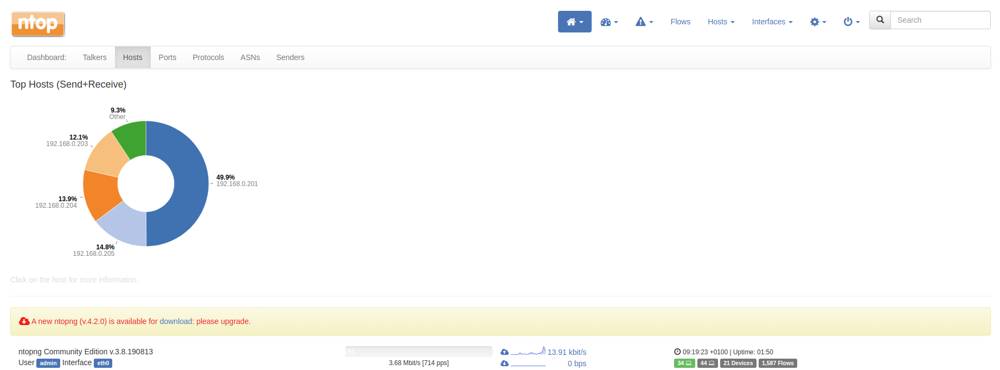
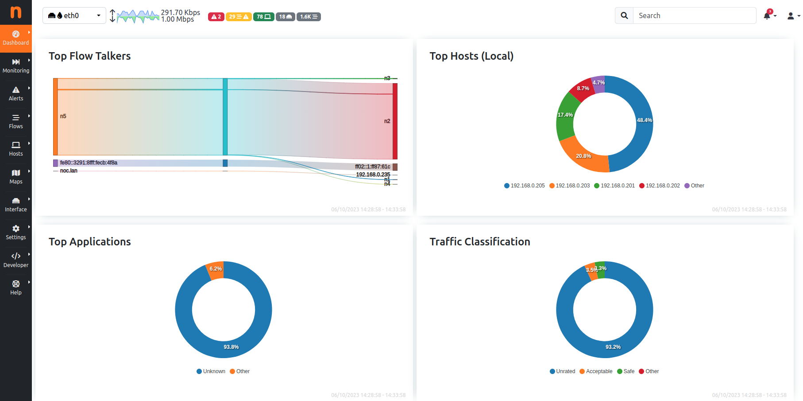

# PI4 Stories

## Raspberry Pi 4 cluster Series - Deploying ntopng with helm

### Download the GitHub sources of ntopng

We liked the [ntopng application](https://github.com/ntop/ntopng) [1] so we thought why not integrate it with our kubernetes cluster. However, the original project did not have the required code to integrate it with our kubernetes cluster, but we did find another [project](https://github.com/MySocialApp/kubernetes-helm-chart-ntopng.git) that provides a helm chart for ntopng. Yet another chalenge was building an image for arm64.

Therefore, we cloned these 2 projects into our [pi4-ntopng github project](https://github.com/gdha/pi4-ntopng) [2].

We have 2 ways to build a pi4_ntopng container. One with the `build.sh` script which uses the ntopng package which available in ubuntu 20.04 repository (currently version 3.8.190813 or v1.5). The second way is building from scratch (from the sources of https://github.com/ntop/ntopng dev branch) with the script `builder.sh` which uses the development version (beginning of October 2023 it is version 5.7.0 or v1.9).

### Build pi4-ntopng with build.sh script (arm64)

We builded the pi4_ntopng with the `build.sh` script that uses the ntopng executable provided by the operating system used by the container (in our case ubuntu 20). To test the image (version 3.8.190813) with docker (before trying to integrate it within kubernetes) we can do the following:

```bash
$ docker run --net=host -t -p 3000:3000 ghcr.io/gdha/pi4-ntopng:v1.5
WARNING: Published ports are discarded when using host network mode
Starting redis-server: redis-server.
23/Feb/2023 15:54:51 [Ntop.cpp:1902] Setting local networks to 127.0.0.0/8
23/Feb/2023 15:54:51 [Redis.cpp:127] Successfully connected to redis 127.0.0.1:6379@0
23/Feb/2023 15:54:51 [Redis.cpp:127] Successfully connected to redis 127.0.0.1:6379@0
23/Feb/2023 15:54:52 [PcapInterface.cpp:93] Reading packets from interface veth51dfafac...
23/Feb/2023 15:54:52 [Ntop.cpp:1996] Registered interface veth51dfafac [id: 1]
sh: 1: netstat: not found
23/Feb/2023 15:54:52 [PcapInterface.cpp:93] Reading packets from interface eth0...
23/Feb/2023 15:54:52 [Ntop.cpp:1996] Registered interface eth0 [id: 2]
sh: 1: netstat: not found
23/Feb/2023 15:54:52 [PcapInterface.cpp:93] Reading packets from interface cni0...
23/Feb/2023 15:54:52 [Ntop.cpp:1996] Registered interface cni0 [id: 3]
sh: 1: netstat: not found
23/Feb/2023 15:54:53 [PcapInterface.cpp:93] Reading packets from interface flannel.1...
23/Feb/2023 15:54:53 [Ntop.cpp:1996] Registered interface flannel.1 [id: 4]
23/Feb/2023 15:54:53 [PcapInterface.cpp:93] Reading packets from interface vethfa36f5b1...
23/Feb/2023 15:54:53 [Ntop.cpp:1996] Registered interface vethfa36f5b1 [id: 5]
23/Feb/2023 15:54:53 [PcapInterface.cpp:93] Reading packets from interface veth8ab316d2...
23/Feb/2023 15:54:53 [Ntop.cpp:1996] Registered interface veth8ab316d2 [id: 6]
23/Feb/2023 15:54:53 [PcapInterface.cpp:93] Reading packets from interface vethcbc7a4d3...
23/Feb/2023 15:54:53 [Ntop.cpp:1996] Registered interface vethcbc7a4d3 [id: 7]
23/Feb/2023 15:54:54 [PcapInterface.cpp:93] Reading packets from interface veth4b6b52e6...
23/Feb/2023 15:54:54 [Ntop.cpp:1996] Registered interface veth4b6b52e6 [id: 8]
23/Feb/2023 15:54:54 [PcapInterface.cpp:93] Reading packets from interface veth78a0b0e7...
23/Feb/2023 15:54:54 [Ntop.cpp:1996] Registered interface veth78a0b0e7 [id: 9]
23/Feb/2023 15:54:55 [PcapInterface.cpp:93] Reading packets from interface veth6e8b72d7...
23/Feb/2023 15:54:55 [Ntop.cpp:1996] Registered interface veth6e8b72d7 [id: 10]
23/Feb/2023 15:54:55 [PcapInterface.cpp:93] Reading packets from interface veth9cbeefd9...
23/Feb/2023 15:54:55 [Ntop.cpp:1996] Registered interface veth9cbeefd9 [id: 11]
23/Feb/2023 15:54:55 [PcapInterface.cpp:93] Reading packets from interface veth1f978b38...
23/Feb/2023 15:54:55 [Ntop.cpp:1996] Registered interface veth1f978b38 [id: 12]
23/Feb/2023 15:54:55 [PcapInterface.cpp:93] Reading packets from interface veth95b9e068...
23/Feb/2023 15:54:55 [Ntop.cpp:1996] Registered interface veth95b9e068 [id: 13]
23/Feb/2023 15:54:55 [PcapInterface.cpp:93] Reading packets from interface vethc58d8e82...
23/Feb/2023 15:54:55 [Ntop.cpp:1996] Registered interface vethc58d8e82 [id: 14]
23/Feb/2023 15:54:55 [PcapInterface.cpp:93] Reading packets from interface veth06e8023d...
23/Feb/2023 15:54:55 [Ntop.cpp:1996] Registered interface veth06e8023d [id: 15]
23/Feb/2023 15:54:55 [PcapInterface.cpp:93] Reading packets from interface vethed261334...
23/Feb/2023 15:54:55 [Ntop.cpp:1996] Registered interface vethed261334 [id: 16]
23/Feb/2023 15:54:56 [PcapInterface.cpp:93] Reading packets from interface vethce929971...
23/Feb/2023 15:54:56 [Ntop.cpp:1996] Registered interface vethce929971 [id: 17]
23/Feb/2023 15:54:56 [PcapInterface.cpp:93] Reading packets from interface vethd9135091...
23/Feb/2023 15:54:56 [Ntop.cpp:1996] Registered interface vethd9135091 [id: 18]
23/Feb/2023 15:54:56 [PcapInterface.cpp:93] Reading packets from interface lo...
23/Feb/2023 15:54:56 [Ntop.cpp:1996] Registered interface lo [id: 19]
sh: 1: netstat: not found
23/Feb/2023 15:54:56 [PcapInterface.cpp:93] Reading packets from interface docker0...
23/Feb/2023 15:54:56 [Ntop.cpp:1996] Registered interface docker0 [id: 20]
23/Feb/2023 15:54:56 [main.cpp:308] PID stored in file /var/run/ntopng.pid
23/Feb/2023 15:54:57 [HTTPserver.cpp:1029] HTTPS Disabled: missing SSL certificate /usr/share/ntopng/httpdocs/ssl/ntopng-cert.pem
23/Feb/2023 15:54:57 [HTTPserver.cpp:1031] Please read https://github.com/ntop/ntopng/blob/dev/doc/README.SSL if you want to enable SSL.
23/Feb/2023 15:54:57 [Utils.cpp:563] WARNING: Unable to retain privileges for privileged file writing
23/Feb/2023 15:54:57 [Utils.cpp:592] User changed to ntopng
23/Feb/2023 15:54:57 [HTTPserver.cpp:1198] Web server dirs [/usr/share/ntopng/httpdocs][/usr/share/ntopng/scripts]
23/Feb/2023 15:54:57 [HTTPserver.cpp:1201] HTTP server listening on 3000
23/Feb/2023 15:54:57 [main.cpp:390] Working directory: /var/lib/ntopng
23/Feb/2023 15:54:57 [main.cpp:392] Scripts/HTML pages directory: /usr/share/ntopng
23/Feb/2023 15:54:57 [Ntop.cpp:403] Welcome to ntopng aarch64 v.3.8.190813 - (C) 1998-18 ntop.org
23/Feb/2023 15:54:57 [Ntop.cpp:717] Adding 127.0.0.1/32 as IPv4 interface address for lo
23/Feb/2023 15:54:57 [Ntop.cpp:725] Adding 127.0.0.0/8 as IPv4 local network for lo
23/Feb/2023 15:54:57 [Ntop.cpp:717] Adding 192.168.0.201/32 as IPv4 interface address for eth0
23/Feb/2023 15:54:57 [Ntop.cpp:725] Adding 192.168.0.0/24 as IPv4 local network for eth0
23/Feb/2023 15:54:57 [Ntop.cpp:717] Adding 172.17.0.1/32 as IPv4 interface address for docker0
23/Feb/2023 15:54:57 [Ntop.cpp:725] Adding 172.17.0.0/16 as IPv4 local network for docker0
23/Feb/2023 15:54:57 [Ntop.cpp:717] Adding 10.42.0.0/32 as IPv4 interface address for flannel.1
23/Feb/2023 15:54:57 [Ntop.cpp:725] Adding 10.42.0.0/32 as IPv4 local network for flannel.1
23/Feb/2023 15:54:57 [Ntop.cpp:717] Adding 10.42.0.1/32 as IPv4 interface address for cni0
23/Feb/2023 15:54:57 [Ntop.cpp:725] Adding 10.42.0.0/24 as IPv4 local network for cni0
23/Feb/2023 15:54:57 [Ntop.cpp:744] Adding fd28:f4dd:39e1:0:dea6:32ff:fe87:61f/128 as IPv6 interface address for eth0
23/Feb/2023 15:54:57 [Ntop.cpp:753] Adding fd28:f4dd:39e1:0:dea6:32ff:fe87:61f/64 as IPv6 local network for eth0
23/Feb/2023 15:54:57 [Ntop.cpp:744] Adding 2a02:a03f:837b:a800:dea6:32ff:fe87:61f/128 as IPv6 interface address for eth0
23/Feb/2023 15:54:57 [Ntop.cpp:753] Adding 2a02:a03f:837b:a800:dea6:32ff:fe87:61f/64 as IPv6 local network for eth0
23/Feb/2023 15:54:57 [Ntop.cpp:744] Adding fe80::dea6:32ff:fe87:61f/128 as IPv6 interface address for eth0
23/Feb/2023 15:54:57 [Ntop.cpp:753] Adding fe80::dea6:32ff:fe87:61f/64 as IPv6 local network for eth0
23/Feb/2023 15:55:11 [PeriodicActivities.cpp:72] Started periodic activities loop...
23/Feb/2023 15:55:12 [PeriodicActivities.cpp:113] Each periodic activity script will use 5 threads
23/Feb/2023 15:55:12 [NetworkInterface.cpp:2577] Started packet polling on interface veth51dfafac [id: 1]...
23/Feb/2023 15:55:12 [NetworkInterface.cpp:2577] Started packet polling on interface eth0 [id: 2]...
23/Feb/2023 15:55:12 [NetworkInterface.cpp:2577] Started packet polling on interface cni0 [id: 3]...
23/Feb/2023 15:55:12 [NetworkInterface.cpp:2577] Started packet polling on interface flannel.1 [id: 4]...
23/Feb/2023 15:55:12 [NetworkInterface.cpp:2577] Started packet polling on interface vethfa36f5b1 [id: 5]...
23/Feb/2023 15:55:12 [NetworkInterface.cpp:2577] Started packet polling on interface veth8ab316d2 [id: 6]...
23/Feb/2023 15:55:12 [NetworkInterface.cpp:2577] Started packet polling on interface vethcbc7a4d3 [id: 7]...
23/Feb/2023 15:55:12 [NetworkInterface.cpp:2577] Started packet polling on interface veth4b6b52e6 [id: 8]...
23/Feb/2023 15:55:12 [NetworkInterface.cpp:2577] Started packet polling on interface veth78a0b0e7 [id: 9]...
23/Feb/2023 15:55:12 [NetworkInterface.cpp:2577] Started packet polling on interface veth6e8b72d7 [id: 10]...
23/Feb/2023 15:55:12 [NetworkInterface.cpp:2577] Started packet polling on interface veth9cbeefd9 [id: 11]...
23/Feb/2023 15:55:12 [NetworkInterface.cpp:2577] Started packet polling on interface veth1f978b38 [id: 12]...
23/Feb/2023 15:55:12 [NetworkInterface.cpp:2577] Started packet polling on interface veth95b9e068 [id: 13]...
23/Feb/2023 15:55:12 [NetworkInterface.cpp:2577] Started packet polling on interface vethc58d8e82 [id: 14]...
23/Feb/2023 15:55:12 [NetworkInterface.cpp:2577] Started packet polling on interface veth06e8023d [id: 15]...
23/Feb/2023 15:55:12 [NetworkInterface.cpp:2577] Started packet polling on interface vethed261334 [id: 16]...
23/Feb/2023 15:55:12 [NetworkInterface.cpp:2577] Started packet polling on interface vethce929971 [id: 17]...
23/Feb/2023 15:55:12 [NetworkInterface.cpp:2577] Started packet polling on interface vethd9135091 [id: 18]...
23/Feb/2023 15:55:12 [NetworkInterface.cpp:2577] Started packet polling on interface lo [id: 19]...
23/Feb/2023 15:55:12 [NetworkInterface.cpp:2577] Started packet polling on interface docker0 [id: 20]...
23/Feb/2023 15:55:12 [NetworkInterface.cpp:2007] Invalid packet received [len: 2862][max len: 1468].
23/Feb/2023 15:55:12 [NetworkInterface.cpp:2008] WARNING: If you have TSO/GRO enabled, please disable it
23/Feb/2023 15:55:12 [NetworkInterface.cpp:2010] WARNING: Use sudo ethtool -K vethed261334 gro off gso off tso off
23/Feb/2023 15:55:12 [NetworkInterface.cpp:2007] Invalid packet received [len: 6018][max len: 1468].
23/Feb/2023 15:55:12 [NetworkInterface.cpp:2008] WARNING: If you have TSO/GRO enabled, please disable it
23/Feb/2023 15:55:12 [NetworkInterface.cpp:2010] WARNING: Use sudo ethtool -K veth8ab316d2 gro off gso off tso off
23/Feb/2023 15:55:12 [NetworkInterface.cpp:2007] Invalid packet received [len: 2764][max len: 1468].
23/Feb/2023 15:55:12 [NetworkInterface.cpp:2008] WARNING: If you have TSO/GRO enabled, please disable it
23/Feb/2023 15:55:12 [NetworkInterface.cpp:2010] WARNING: Use sudo ethtool -K veth4b6b52e6 gro off gso off tso off
23/Feb/2023 15:55:12 [NetworkInterface.cpp:2007] Invalid packet received [len: 2381][max len: 1468].
23/Feb/2023 15:55:12 [NetworkInterface.cpp:2008] WARNING: If you have TSO/GRO enabled, please disable it
23/Feb/2023 15:55:12 [NetworkInterface.cpp:2010] WARNING: Use sudo ethtool -K veth78a0b0e7 gro off gso off tso off
23/Feb/2023 15:55:12 [NetworkInterface.cpp:2007] Invalid packet received [len: 2381][max len: 1468].
23/Feb/2023 15:55:12 [NetworkInterface.cpp:2008] WARNING: If you have TSO/GRO enabled, please disable it
23/Feb/2023 15:55:12 [NetworkInterface.cpp:2010] WARNING: Use sudo ethtool -K cni0 gro off gso off tso off
23/Feb/2023 15:55:12 [NetworkInterface.cpp:2007] Invalid packet received [len: 4162][max len: 1468].
23/Feb/2023 15:55:12 [NetworkInterface.cpp:2008] WARNING: If you have TSO/GRO enabled, please disable it
23/Feb/2023 15:55:12 [NetworkInterface.cpp:2010] WARNING: Use sudo ethtool -K veth1f978b38 gro off gso off tso off
23/Feb/2023 15:55:12 [NetworkInterface.cpp:2007] Invalid packet received [len: 2862][max len: 1468].
23/Feb/2023 15:55:12 [NetworkInterface.cpp:2008] WARNING: If you have TSO/GRO enabled, please disable it
23/Feb/2023 15:55:12 [NetworkInterface.cpp:2010] WARNING: Use sudo ethtool -K veth95b9e068 gro off gso off tso off
23/Feb/2023 15:55:12 [NetworkInterface.cpp:2007] Invalid packet received [len: 5658][max len: 1468].
23/Feb/2023 15:55:12 [NetworkInterface.cpp:2008] WARNING: If you have TSO/GRO enabled, please disable it
23/Feb/2023 15:55:12 [NetworkInterface.cpp:2010] WARNING: Use sudo ethtool -K flannel.1 gro off gso off tso off
23/Feb/2023 15:55:12 [NetworkInterface.cpp:2007] Invalid packet received [len: 2862][max len: 1468].
23/Feb/2023 15:55:12 [NetworkInterface.cpp:2008] WARNING: If you have TSO/GRO enabled, please disable it
23/Feb/2023 15:55:12 [NetworkInterface.cpp:2010] WARNING: Use sudo ethtool -K vethc58d8e82 gro off gso off tso off
23/Feb/2023 15:55:13 [NetworkInterface.cpp:2007] Invalid packet received [len: 5708][max len: 1518].
23/Feb/2023 15:55:13 [NetworkInterface.cpp:2008] WARNING: If you have TSO/GRO enabled, please disable it
23/Feb/2023 15:55:13 [NetworkInterface.cpp:2010] WARNING: Use sudo ethtool -K eth0 gro off gso off tso off
23/Feb/2023 15:55:14 [NetworkInterface.cpp:2007] Invalid packet received [len: 4193][max len: 1468].
23/Feb/2023 15:55:14 [NetworkInterface.cpp:2008] WARNING: If you have TSO/GRO enabled, please disable it
23/Feb/2023 15:55:14 [NetworkInterface.cpp:2010] WARNING: Use sudo ethtool -K veth06e8023d gro off gso off tso off
23/Feb/2023 15:58:35 [NetworkInterface.cpp:2007] Invalid packet received [len: 1690][max len: 1468].
23/Feb/2023 15:58:35 [NetworkInterface.cpp:2008] WARNING: If you have TSO/GRO enabled, please disable it
23/Feb/2023 15:58:35 [NetworkInterface.cpp:2010] WARNING: Use sudo ethtool -K vethd9135091 gro off gso off tso off
23/Feb/2023 15:58:35 [NetworkInterface.cpp:2007] Invalid packet received [len: 1690][max len: 1468].
23/Feb/2023 15:58:35 [NetworkInterface.cpp:2008] WARNING: If you have TSO/GRO enabled, please disable it
23/Feb/2023 15:58:35 [NetworkInterface.cpp:2010] WARNING: Use sudo ethtool -K veth9cbeefd9 gro off gso off tso off
```

Open a browser and access the ntopng application via URL `http:<ip address of docker host>:3000/`



### Build pi4-ntopng from the sources with builder.sh script (arm64)

The `builder.sh` script is using the `Dockerfile.builder` to build the ntopng executable from scratch and it was a serious battle to get it working, but we are proud on the result. By using the `builder.sh` script we also get the complete log saved as `builder.log` which might be useful when something went wrong. It might be that the compilation fails as we are using the development branch of the ntopng project. If all goed well we always have the state of art application of ntopng.

To test with docker use the same method as described above with the `build.sh` script.

Open a browser and access the ntopng application via URL `http:<ip address of docker host>:3000/`



### Use the kubernetes helm chart to get it into kubernetes

Go into directory `kubernetes-helm-chart-ntopng` and review the `kubernetes/Chart.yaml` and `kubernetes/values.yaml` files. We have pinned it to use version *5.7.0*.

```bash
$ kubectl create -f ./kubernetes/namespace.yaml

$ helm install --debug --dry-run --namespace ntopng ntopng ./kubernetes
install.go:193: [debug] Original chart version: ""
install.go:210: [debug] CHART PATH: /home/gdha/projects/pi4-ntopng/kubernetes-helm-chart-ntopng/kubernetes

walk.go:74: found symbolic link in path: /home/gdha/projects/pi4-ntopng/kubernetes-helm-chart-ntopng/kubernetes/templates/ghcr-secret.yaml resolves to /home/gdha/projects/pi4-ntopng/kubernetes-helm-chart-ntopng/kubernetes/templates/.hidden/ghcr-secret.yaml. Contents of linked file included and used
NAME: ntopng
LAST DEPLOYED: Fri Oct  6 16:25:29 2023
NAMESPACE: ntopng
STATUS: pending-install
REVISION: 1
TEST SUITE: None
USER-SUPPLIED VALUES:
{}

COMPUTED VALUES:
ntopngConfig: |-
  --disable-login=1
  --dns-mode=3
  # Limit memory usage
  --max-num-flows=200000
  --max-num-hosts=250000
  #--interface=xxxxxx
  --no-promisc
ntopngImageName: ghcr.io/gdha/pi4-ntopng
ntopngImageVersion: 5.7.0
ntopngNodeSelector:
  kubernetes.io/os: linux
ntopngResources: null
ntopngService:
  port: 80
  type: LoadBalancer

HOOKS:
MANIFEST:
---
# Source: ntopng/templates/ghcr-secret.yaml
# kubectl create secret docker-registry dockerconfigjson-github-com --docker-server=ghcr.io  --docker-username=$USER --docker-password=$(cat ~/.ghcr-token) --dry-run=client -oyaml >.hidden/ghcr-secret.yaml
#  ln -s  .hidden/ghcr-secret.yaml ghcr-secret.yaml
# Edit ghcr-secret.yaml and modify namespace and labels in the metadata section.
apiVersion: v1
kind: Secret
metadata:
  name: ntopng-ghrc
  namespace: ntopng
  labels:
    app: ntopng
    chart: ntopng-5.7.0
    release: ntopng
    heritage: Helm
  creationTimestamp: null
type: kubernetes.io/dockerconfigjson
data:
  .dockerconfigjson: xxxxxxxxxxxxxxxxxxxxxxxxxxxxxxxxxxxxxxx
---
# Source: ntopng/templates/secrets.yaml
apiVersion: v1
kind: Secret
metadata:
  name: ntopng
  namespace: ntopng
  labels:
    app: ntopng
    chart: ntopng-5.7.0
    release: ntopng
    heritage: Helm
type: Opaque
---
# Source: ntopng/templates/configmap.yaml
apiVersion: v1
kind: ConfigMap
metadata:
  name: ntopng
  namespace: ntopng
  labels:
    app: ntopng
    chart: ntopng-5.7.0
    release: ntopng
    heritage: Helm
data:
  ntopng.conf: |-
    --disable-login=1
    --dns-mode=3
    # Limit memory usage
    --max-num-flows=200000
    --max-num-hosts=250000
    #--interface=xxxxxx
    --no-promisc
---
# Source: ntopng/templates/service.yaml
apiVersion: v1
kind: Service
metadata:
  name: ntopng
  namespace: ntopng
  labels:
    app: ntopng
    chart: ntopng-5.7.0
    release: ntopng
    heritage: Helm
spec:
  type: LoadBalancer
  externalTrafficPolicy: Local
  selector:
    app: ntopng
  ports:
  - name: ntopng
    port: 80
    targetPort: 3000
    protocol: TCP
---
# Source: ntopng/templates/deployment.yaml
apiVersion: apps/v1
kind: Deployment
metadata:
  name: ntopng
  namespace: ntopng
  labels:
    app: ntopng
    chart: ntopng-5.7.0
    release: ntopng
    heritage: Helm
spec:
  replicas: 1
  selector:
    matchLabels:
      app: ntopng
  template:
    metadata:
      labels:
        app: ntopng
        chart: ntopng-5.7.0
        release: ntopng
        heritage: Helm
    spec:
      terminationGracePeriodSeconds: 10
      hostNetwork: true
      nodeSelector:
        kubernetes.io/os: "linux"
      imagePullSecrets:
        - name: ntopng-ghrc
      containers:
      - name: ntopng
        image: ghcr.io/gdha/pi4-ntopng:5.7.0
        imagePullPolicy: IfNotPresent
        ports:
        - name: ntopng
          containerPort: 3000
          protocol: TCP
        resources:
            null

        env:
          - name: CONFIG
            value: /ntopng/ntopng.conf
        volumeMounts:
        - name: config
          mountPath: /ntopng
      volumes:
      - name: config
        configMap:
          name: ntopng
```

To find the endpoint IP address to point to in the web browser do the following:

```bash
$ kubectl get endpoints -n ntopng
NAME     ENDPOINTS            AGE
ntopng   192.168.0.205:3000   32h
```

### Rederences

[1] [GitHub project ntopng](https://github.com/ntop/ntopng)

[2] [GitHub project ntopng with helm chart for arm64](https://github.com/gdha/pi4-ntopng)
