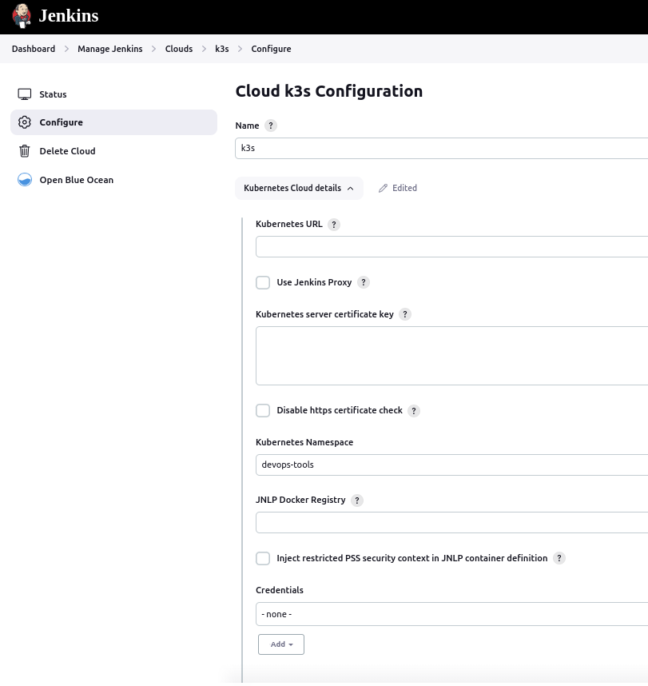
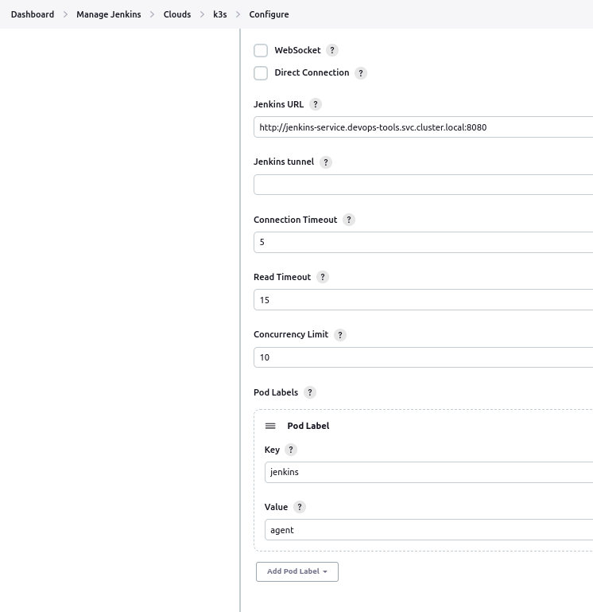
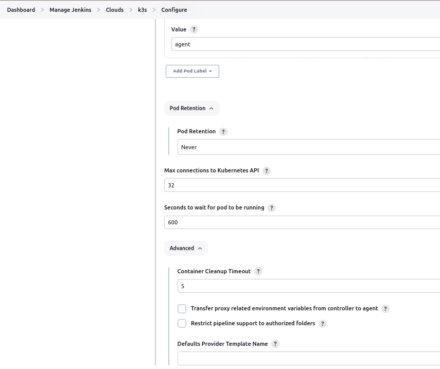
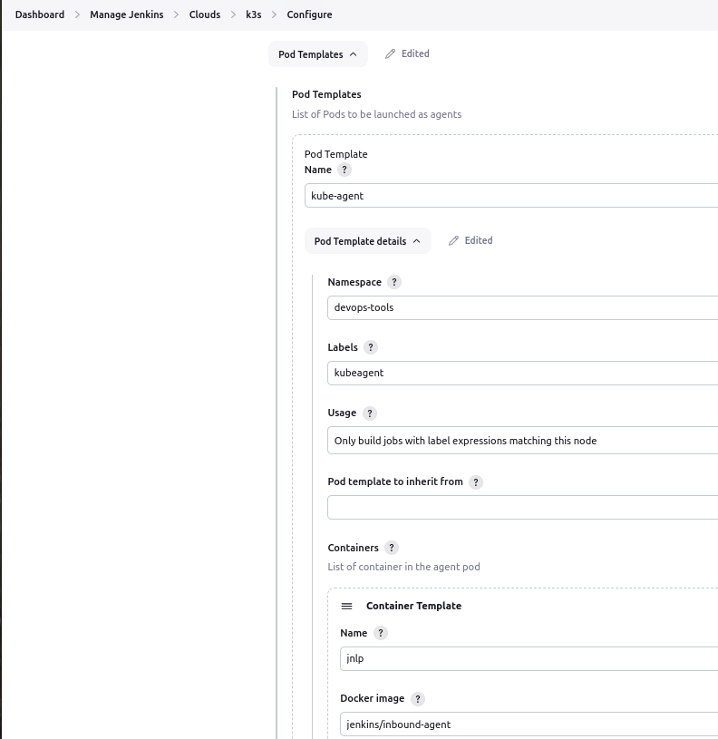

# PI4 Stories

## Raspberry Pi 4 cluster Series - Deploying Jenkins with yaml files

### Download the GitHub yaml sources of Jenkins POD

We do not want copy/paste the procedure in setting up Jenkins on a kubernetes cluster described in [article - How To Setup Jenkins On Kubernetes Cluster – Beginners Guide](https://devopscube.com/setup-jenkins-on-kubernetes-cluster/)] [2].

However, the sources we used to set it up in our cluster can be download from our [pi4-jenkins github project](https://github.com/gdha/pi4-jenkins) [1].

### Basic configuration of the Jenkins application in our cluster

After doing the first initial Jenkins configuration and adding some packages you might need or find useful we can define our k3s cluster within Jenkins so we can use it to deploy an Jenkins agent via k3s. Therefore, go to "Manage Jenkins -> Clouds" and select on the button "new cloud". Then fill in what you see below:









### Set up a workflow k3s-test

We can create a simple pipeline workflow within Jenkins called `k3s-test` and add a simple test script in the pipeline section:

```
// Uses Declarative syntax to run commands inside a container.
pipeline {
    agent {
        kubernetes {
            defaultContainer 'jnlp'
        }
    }
    stages {
        stage('Main') {
            steps {
                sh 'hostname; ls /'
            }
        }
    }
}
```
Then, just click on the "Build Now" button to get some action and wait for the result (output of the console):

```bash
Started by user gratien dhaese
[Pipeline] Start of Pipeline
[Pipeline] podTemplate
[Pipeline] {
[Pipeline] node
Created Pod: k3s devops-tools/k3s-test-12-r7t20-tp9h0-w3md4
Still waiting to schedule task
‘k3s-test-12-r7t20-tp9h0-w3md4’ is offline
Agent k3s-test-12-r7t20-tp9h0-w3md4 is provisioned from template k3s-test_12-r7t20-tp9h0
---
apiVersion: "v1"
kind: "Pod"
metadata:
  annotations:
    buildUrl: "http://jenkins-service.devops-tools.svc.cluster.local:8080/job/k3s-test/12/"
    runUrl: "job/k3s-test/12/"
  labels:
    jenkins: "agent"
    jenkins/label-digest: "3ea935590b9ee455238d862a312e8637c1a83963"
    jenkins/label: "k3s-test_12-r7t20"
  name: "k3s-test-12-r7t20-tp9h0-w3md4"
  namespace: "devops-tools"
spec:
  containers:
  - env:
    - name: "JENKINS_SECRET"
      value: "********"
    - name: "JENKINS_AGENT_NAME"
      value: "k3s-test-12-r7t20-tp9h0-w3md4"
    - name: "JENKINS_NAME"
      value: "k3s-test-12-r7t20-tp9h0-w3md4"
    - name: "JENKINS_AGENT_WORKDIR"
      value: "/home/jenkins/agent"
    - name: "JENKINS_URL"
      value: "http://jenkins-service.devops-tools.svc.cluster.local:8080/"
    image: "jenkins/inbound-agent:3148.v532a_7e715ee3-1"
    name: "jnlp"
    resources:
      requests:
        memory: "256Mi"
        cpu: "100m"
    volumeMounts:
    - mountPath: "/home/jenkins/agent"
      name: "workspace-volume"
      readOnly: false
  nodeSelector:
    kubernetes.io/os: "linux"
  restartPolicy: "Never"
  volumes:
  - emptyDir:
      medium: ""
    name: "workspace-volume"

Running on k3s-test-12-r7t20-tp9h0-w3md4 in /home/jenkins/agent/workspace/k3s-test
[Pipeline] {
[Pipeline] stage
[Pipeline] { (Main)
[Pipeline] sh
+ hostname
k3s-test-12-r7t20-tp9h0-w3md4
+ ls /
bin
boot
dev
etc
home
lib
media
mnt
opt
proc
root
run
sbin
srv
sys
tmp
usr
var
[Pipeline] }
[Pipeline] // stage
[Pipeline] }
[Pipeline] // node
[Pipeline] }
[Pipeline] // podTemplate
[Pipeline] End of Pipeline
Finished: SUCCESS
```

### References

[1] [Github sources of the Pi4 Jenkins kubernetes yaml files](https://github.com/gdha/pi4-jenkins)

[2] [How To Setup Jenkins On Kubernetes Cluster – Beginners Guide](https://devopscube.com/setup-jenkins-on-kubernetes-cluster/)
