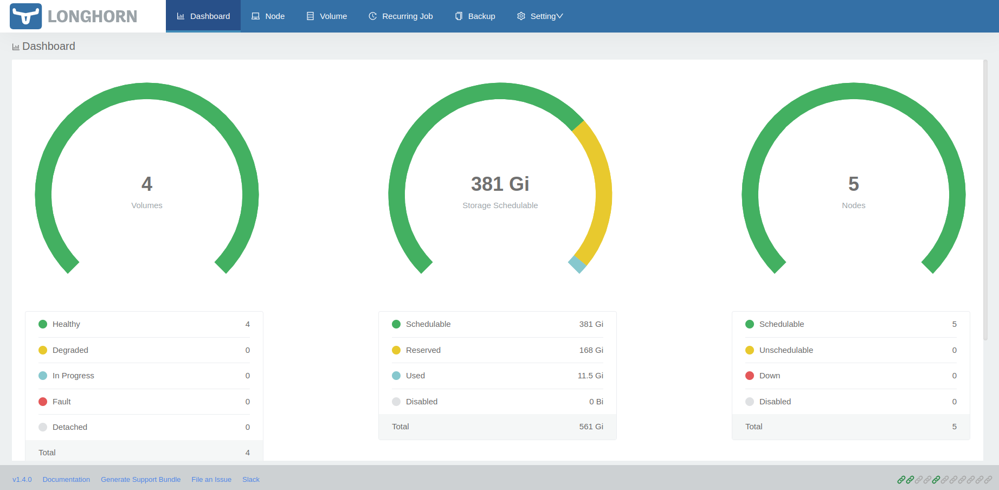
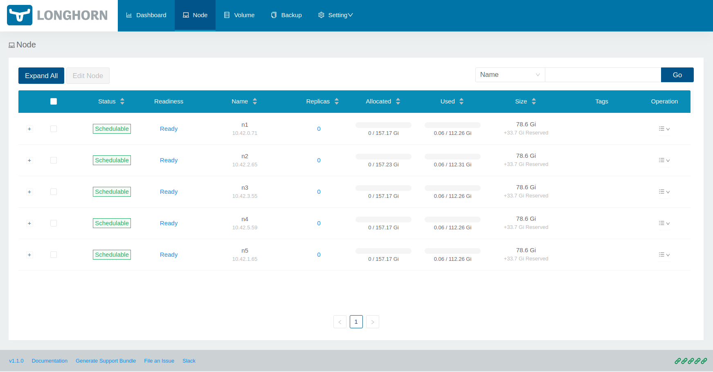
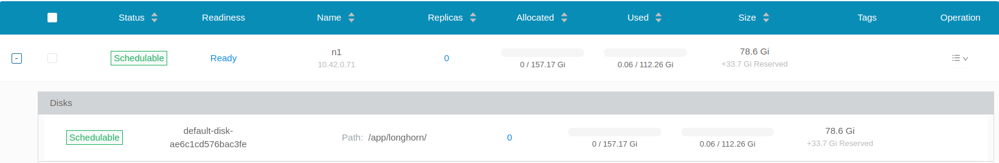

# PI4 Stories

## Raspberry Pi 4 cluster Series - Installation of Longhorn

### Prepare our external USB block devices

On all our pi systems we added an USB block device of the same size and we are sure that they all put in the same USB port so that we are sure the all have the same block device name, e.g. /dev/sda

We create an [ansible playbook to prepare the USB block devices](https://github.com/gdha/pi4-longhorn/blob/main/prepare-usb-disk/readme.md) and have it mounted on `/app/longhorn` on each node. E.g.

```bash
$ df /app/longhorn/
Filesystem     1K-blocks  Used Available Use% Mounted on
/dev/sda1      117715864 61472 111631688   1% /app/longhorn
```

### Using helm to perform the installation

If we want to use `helm` to performt the installation of longhorn we first need to install it as it isn't standard avaibale on these systems. Getting `helm` from URL [https://helm.sh/docs/intro/install/](https://helm.sh/docs/intro/install/).

```bash
$ curl -fsSL -o get_helm.sh https://raw.githubusercontent.com/helm/helm/master/scripts/get-helm-3
$ chmod 700 get_helm.sh
$ ./get_helm.sh 
Downloading https://get.helm.sh/helm-v3.5.3-linux-arm64.tar.gz
Verifying checksum... Done.
Preparing to install helm into /usr/local/bin
helm installed into /usr/local/bin/helm
```

Alright, now we have the `helm` executable available on our local system (e.g.node n1). We can now download the helm longhorn chart repository:

```bash
$ helm repo add longhorn https://charts.longhorn.io
"longhorn" has been added to your repositories

$ helm repo update
Hang tight while we grab the latest from your chart repositories...
...Successfully got an update from the "longhorn" chart repository
Update Complete. ⎈Happy Helming!⎈
```

We need to be careful when we run the helm installer as we only want longhorn to use the USB block devices mounted at `/app/longhorn` and it should not be using the default location `/var/lib/longhorn` (as this might fill up the root partition).
Information on how we can actually do this can be found at ["Adding Node Tags to New Nodes"](https://longhorn.io/docs/1.1.0/advanced-resources/default-disk-and-node-config/):


```bash
$ helm install longhorn longhorn/longhorn --namespace longhorn-system \
  --set defaultSettings.defaultDataPath="/app/longhorn/"
NAME: longhorn
LAST DEPLOYED: Wed Apr 14 09:23:52 2021
NAMESPACE: longhorn-system
STATUS: deployed
REVISION: 1
TEST SUITE: None
NOTES:
Longhorn is now installed on the cluster!

Please wait a few minutes for other Longhorn components such as CSI deployments, Engine Images, and Instance Managers to be initialized.

Visit our documentation at https://longhorn.io/docs/
```
### Prepare the longhorn-ingress (required for UI)

In-depth information about accessing the longhorn UI can be found at [longhorn-ingress](https://longhorn.io/docs/1.1.0/deploy/accessing-the-ui/longhorn-ingress/).

In short this is the procedure we followed:

```bash
$ USER=gdha; PASSWORD=*******; echo "${USER}:$(openssl passwd -stdin -apr1 <<< ${PASSWORD})" >> auth


$ cat auth 
gdha:$apr1$XXXXXXXXXXXXXXXXXXXXXXXX

$ kubectl -n longhorn-system create secret generic basic-auth --from-file=auth
secret/basic-auth created

$ kubectl -n longhorn-system get secret basic-auth -o yaml
apiVersion: v1
data:
  auth: Z2RoYTokYXByMSRLTU1hQWpiSiROVENtRWI2Qm05dDdvSmJXV1RlWVcuCg==
kind: Secret
metadata:
  creationTimestamp: "2021-04-09T15:38:05Z"
  managedFields:
  - apiVersion: v1
    fieldsType: FieldsV1
    fieldsV1:
      f:data:
        .: {}
        f:auth: {}
      f:type: {}
    manager: kubectl-create
    operation: Update
    time: "2021-04-09T15:38:05Z"
  name: basic-auth
  namespace: longhorn-system
  resourceVersion: "763254"
  uid: 0a88e170-071d-4813-934f-9dec352be01d
type: Opaque
```
Then we paste the following set of yaml command lines into kubectl to create the longhorn-ingress:

```bash
$ echo "
apiVersion: networking.k8s.io/v1
kind: Ingress
metadata:
  name: longhorn-ingress
  namespace: longhorn-system
  annotations:
    # type of authentication
    nginx.ingress.kubernetes.io/auth-type: basic
    # prevent the controller from redirecting (308) to HTTPS
    nginx.ingress.kubernetes.io/ssl-redirect: 'false'
    # name of the secret that contains the user/password definitions
    nginx.ingress.kubernetes.io/auth-secret: basic-auth
    # message to display with an appropriate context why the authentication is required
    nginx.ingress.kubernetes.io/auth-realm: 'Authentication Required '
spec:
  rules:
  - http:
      paths:
      - path: /
        backend:
          serviceName: longhorn-frontend
          servicePort: 80
" | kubectl -n longhorn-system create -f -
ingress.networking.k8s.io/longhorn-ingress created

$ kubectl -n longhorn-system get ingress
NAME               CLASS    HOSTS   ADDRESS         PORTS   AGE
longhorn-ingress   <none>   *       192.168.0.201   80      11s
```
### Use the longhorn UI

In previous command we saw that the IP address where the longhorn-ingress is running is in our case 192.168.0.201 and to test the connectivity we can use `curl`:

```bash
$ curl -v http://192.168.0.201/
*   Trying 192.168.0.201:80...
* TCP_NODELAY set
* Connected to 192.168.0.201 (192.168.0.201) port 80 (#0)
> GET / HTTP/1.1
> Host: 192.168.0.201
> User-Agent: curl/7.68.0
> Accept: */*
...
```

However, we a browser pointing to `http://192.168.0.201/#/dashboard` we get a better overview:



Or, when selecting the node tab:



And, the details of one node:



## References

[1] [Ansible playbook to prepare USB devices](https://github.com/gdha/pi4-longhorn/blob/main/prepare-usb-disk/readme.md)

[2] [Longhorn](https://longhorn.io/)

[3] [Adding Node Tags to New Nodes](https://longhorn.io/docs/1.1.0/advanced-resources/default-disk-and-node-config/)

[4] [Accessing Loghorn through UI](https://longhorn.io/docs/1.1.0/deploy/accessing-the-ui/longhorn-ingress/)
